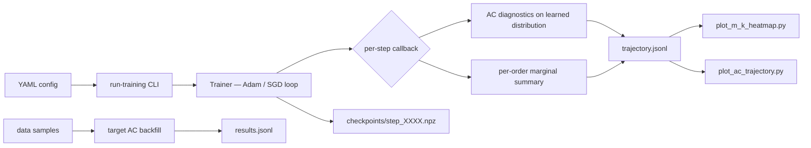

# AC12 Bandwidth Sweep — Results & Walkthrough

> [!abstract] What this note is
> A full walk-through of the `AC12` pipeline run on **2026-04-21**, written as a primer for a teammate who has never touched the project. It uses plain-language (Feynman-technique) explanations alongside the technical details, so it doubles as a presentation script and a 6-months-later refresher. Upstream theory is in [[Anti-Concentration vs Marginal Agreement]]; the infrastructure reference is [[AC7 to AC12 Implementation]]. Corresponding executable plan: `C:\Users\cuqui\.claude\plans\yes-please-write-the-zippy-otter.md`.

> [!success] Headline finding
> At **every** bandwidth σ ∈ {1, 3, 9, 27} the learned distribution is **6–20× smoother** than the target it was trained on. Strict [[Anti-Concentration|anti-concentration]] *passes* trivially; what fails is agreement on high-order marginals — exactly the Rudolph tension from [[References#Paper 2305.02881|2305.02881]]. See [[#6. Results — What the Pipeline Revealed|§6]].

---

## 1. The Big Picture (Feynman Explanation)

> [!tip] In one paragraph (for a non-expert)
> We have a **target** — a fancy probability distribution over bitstrings that we want a quantum circuit to imitate. We **train** the circuit by minimising a distance called MMD² between the circuit's output and the target. The *question* is whether, after training, the circuit's distribution actually matches the target in the ways that matter. Two separate "matches" you could ask about:
>  1. **Anti-concentration**: does the learned distribution spread its probability mass around, or pile it onto a few bitstrings? (A property of *one* distribution.)
>  2. **High-order marginal agreement**: if we read off the correlations between, say, qubits 1, 5, and 8, do the learned correlations match the target's? (A property *relating two* distributions.)
>
> These sound similar, and the supervisor's 2026-04-19 ask mashed them together, but they are different. This note is about keeping them separate — measuring each, watching both evolve during training, and tying the results back to the MMD bandwidth σ.

### Why this matters in one line

If the loss **can't see** a property of the target, training **can't enforce** it — no matter how well the numerical loss decreases.

---

## 2. What We Examined

### 2.1 The paper under scrutiny

[[References#Paper 2503.02934|Recio-Armengol, Ahmed & Bowles (2503.02934)]] train IQP circuits with MMD on real datasets (D-Wave, MNIST, scale-free graphs, genomic data) and claim a "quantum advantage" in distribution learning. Their own bandwidth choices probe average Pauli weight **≤ 17** at $n$ up to 1000. That is *tiny* compared to $n$ — nowhere near the high-correlation regime.

> [!note] Feynman translation
> They trained a quantum circuit with a ruler that can only measure short distances, reported that the distances were short, and concluded the circuit matched the target in *all* ways. But nothing in the training could have checked the long-distance behaviour.

The upstream codebase lives at `src/iqp_mmd/` (read-only reference). Our sandbox for all experiments is `src/iqp_bp/`.

### 2.2 The two supervisor questions (2026-04-19)

> [!question] Q1 — AC of learned distributions
> *"Were the distributions learned in the paper anti-concentrated?"*

> [!question] Q2 — Marginal agreement during training
> *"Does the learned distribution coincide with the ideal one on high-order marginals, and how do marginals evolve during training as a function of the MMD bandwidth σ?"*

See [[Anti-Concentration vs Marginal Agreement]] for the argument that these are **two different questions** and that the *second* is the one that cuts against the paper.

---

## 3. How We Examined It

### 3.1 The pipeline at a glance



### 3.2 Anti-concentration, in plain English

> [!info] Scaled second moment = "peakiness"
> We compute $S := 2^n \sum_x p(x)^2$.
> - If $p$ is **uniform**, $S = 1$ (perfectly spread).
> - If $p$ is a **delta** on one bitstring, $S = 2^n$ (maximally peaked).
> - In general, $S \ge 1$ with larger $S$ meaning peakier.
>
> Strict [[Anti-Concentration|AC]] passes when $S \ge 1$ by a comfortable margin, and when $\hat\beta(\alpha{=}1) := 2^{-n}|\{x : p(x) \ge 2^{-n}\}| \ge 0.25$.

> [!tip] Feynman translation
> "Peakiness" is like variance for distributions. A flat distribution has low peakiness ($S = 1$). A spiky one has high peakiness ($S$ big). Both the target and the learned distribution have their own peakiness — comparing them tells us whether training made the model look more like the target or more like uniform.

We call `check_anti_concentration` on **both** the learned output vector at every checkpoint *and* the target samples once per run.

### 3.3 Marginal agreement via the Walsh/Fourier expansion

> [!info] The identity we exploit
> For any distribution $p$ on $\{0,1\}^n$, its Walsh-Fourier coefficients are
> $$\langle Z_a\rangle_p := \sum_x (-1)^{a\cdot x}\, p(x), \qquad a \in \{0,1\}^n.$$
> The Hamming weight $|a|$ is the **correlation order**. $|a|=1$ = single-qubit statistics. $|a|=k$ = $k$-body correlations.

We measure

$$M_k(\theta) \;=\; \underset{|a|=k}{\operatorname{mean}}\,\bigl(\langle Z_a\rangle_p - \langle Z_a\rangle_{q_\theta}\bigr)^2$$

stratified by order $k$. This is the squared Fourier error — the field `mean_fourier_squared_error` inside `marginal_orders[k]` on every trajectory row.

> [!tip] Feynman translation
> Think of $M_k$ as "how badly do the model's $k$-qubit correlations fail to match the target's?" $M_1 \approx 0$ means single-bit probabilities are spot-on. $M_n$ big means the full-blown correlation across all qubits is wildly wrong. The supervisor's actual question is: *plot $M_k$ as a function of training step and bandwidth σ*.

### 3.4 Why bandwidth σ is the central dial

The Gaussian MMD decomposes along Walsh modes as

$$k_\sigma(x,y) = C\sum_S \tau^{|S|}\chi_S(x)\chi_S(y), \qquad \tau = \tanh\!\tfrac{1}{4\sigma^2}.$$

The fraction of kernel mass on order $k$ is $\binom{n}{k}\tau^k / (1+\tau)^n$ — recorded per row as `order_weight`.

| σ → | small σ (≈ 1) | large σ (≈ 27) |
|---|---|---|
| τ value | large (≈ 0.24) | tiny (≈ 0.0003) |
| Kernel weight on high-$k$ orders | non-trivial | exponentially small |
| Gradient signal for high-$k$ marginals | present but noisy | effectively zero |
| Training dynamics | barren-plateau-prone | fast but myopic |

> [!tip] Feynman translation
> σ is the zoom level of the ruler. σ = 1 is a microscope: fine-grained but shaky. σ = 27 is a telescope: rock-steady but blind to detail. Every σ in the sweep is a different trade-off between seeing-enough-to-learn and having-a-stable-gradient.

See [[Gaussian Convention]] for the locked τ formula and [[Kernel Spectral Decomposition]] for the Walsh-basis identity.

### 3.5 The config we ran

Config: `configs/experiments/bandwidth_marginal_sweep.yaml`

| Knob | Value |
|---|---|
| $n$ | 9 qubits (exact probability vector, $2^9 = 512$ bitstrings) |
| family | `lattice` (ZZ lattice hypergraph) |
| dataset | `binary_mixture` (target with genuine high-order structure) |
| σ grid | $\{1, 3, 9, 27\}$ |
| optimizer | Adam, 20 steps |
| checkpoint cadence | every 5 steps |
| loss mode | exact (enumerate all 512 bitstrings, no sampling) |
| init | uniform over $[-\pi, \pi]$ |

Four independent runs, one per σ, with diagnostics at steps 0, 5, 10, 15, 20.

### 3.6 AC thresholds used in this run

`bandwidth_marginal_sweep.yaml` does **not** override the AC parameters under its `diagnostics` block — it only sets the sampling/enumeration knobs (`sample_count`, `max_order`, `max_subsets_per_order`). So the thresholds fall through to the hard-coded defaults in `src/iqp_bp/experiments/run_training.py:157–161`, which match the locked convention from `configs/base.yaml:86–89` and every `scaling_ac_*.yaml`:

| Knob | Value | Role |
|---|---:|---|
| `alphas` | $(0.5,\ 1.0,\ 2.0)$ | Three α thresholds at which `ac_beta_hat_by_alpha` is recorded per checkpoint. |
| `primary_alpha` | $1.0$ | α used for the main pass/fail check. `ac_primary_beta_hat` on each trajectory row is $\hat\beta(\alpha{=}1)$ — the grey curve on the right axis of `ac_trajectory.png`. |
| `beta_min` | $0.25$ | Pass threshold for $\hat\beta(\alpha{=}1)$: "at least 25% of bitstrings carry at least their fair share ($\ge 1/2^n$)." Grey dotted line at $0.25$ on the right axis. |
| `second_moment_threshold` | $1.0$ | Pass threshold for $S = 2^n \sum_x p(x)^2$. Grey dotted line at $S = 1$ on the left (log) axis. |

Definitions:

$$\hat\beta(\alpha) \;:=\; 2^{-n}\,\bigl|\bigl\{x : p(x) \ge \alpha / 2^n\bigr\}\bigr|$$

$$S \;:=\; 2^n \sum_x p(x)^2$$

These come from the locked finite-$n$ decision rule pinned in [[Anti-Concentration]] (the `AC1` deliverable) — not tuned per experiment. They are the strict Bremner–Montanaro–Shepherd thresholds (see [[#3.7 What the Bremner–Montanaro–Shepherd test is|§3.7]]).

> [!tip] Feynman translation
> Two thresholds, two ways to fail.
> - **$\hat\beta(1) \ge 0.25$**: "at least a quarter of bitstrings carry probability $\ge 1/2^n$." If a distribution piles mass onto fewer bitstrings, it fails.
> - **$S \ge 1$**: "the sum of squared probabilities, rescaled by $2^n$, is at least 1." The uniform distribution hits both thresholds on the nose; anything more peaked than uniform passes with room to spare, anything much *spikier* fails.
>
> These are the same "spread enough" condition viewed through two different lenses.

> [!note] Why we plot only the α = 1 slice
> `ac_beta_hat_by_alpha` on every trajectory row still carries the full α grid $\{0.5, 1.0, 2.0\}$. `plot_ac_trajectory.py` reads only `ac_primary_beta_hat` (α = 1) because that is the value the pass/fail decision uses. Adding a full α sensitivity sweep to the plot is a 10-line change if the supervisor asks.

### 3.7 What the Bremner–Montanaro–Shepherd test is

> [!info] Origin — Bremner, Montanaro & Shepherd (2016), *"Average-case complexity versus approximate simulation of commuting quantum computations"*
> **BMS 2016** proved that classically sampling from an IQP circuit's output distribution, to within total-variation distance $\varepsilon$, is hard under standard complexity conjectures (the Polynomial Hierarchy does not collapse). Their proof needs a technical property of the output distribution called **anti-concentration** so that approximate sampling can be reduced to estimating the probability of an *average* bitstring. Without AC, the reduction breaks.

> [!tip] Feynman translation of the BMS test
> Think of the target distribution as sand on a checkerboard of $2^n$ squares. If the sand is piled onto just a few squares, an "approximate" classical sampler can cheat by guessing those few squares — the hard quantum part never enters the picture. But if the sand is spread so that a meaningful fraction of squares each carry a noticeable amount, then to even approximately sample you must actually *compute* the per-bitstring probabilities — and computing those probabilities is the `#P`-hard operation that gives IQP its quantum advantage. "Anti-concentration" is the precise "spread evenly enough that cheating doesn't work" condition.

Formally, a distribution $p$ on $\{0,1\}^n$ is anti-concentrated in the BMS sense if one of these equivalent statements holds for universal constants:

$$\textbf{Threshold form:}\qquad \Pr_x\!\bigl[\,p(x) \ge \alpha / 2^n\,\bigr] \;\ge\; \beta, \quad \alpha, \beta > 0$$

$$\textbf{Second-moment (collision) form:}\qquad 2^n \sum_x p(x)^2 \;\ge\; \beta', \quad \beta' > 1$$

> [!info] How the two forms connect
> The second-moment form equals the rescaled **collision probability**: if $x, y \sim p$ independently, $\Pr[x = y] = \sum_x p(x)^2$, so $S = 2^n \cdot \Pr[\text{collision}]$. For uniform $p$, collisions happen at rate $1/2^n$, so $S = 1$. A spikier distribution has more collisions, raising $S$. The threshold form counts "above-average" bitstrings directly. BMS use whichever form is more convenient for the current step of the proof; they are equivalent up to the universal constants.

> [!important] Why our thresholds are $(\alpha, \beta_{\min}, S_{\min}) = (1, 0.25, 1)$
> There is no universal "correct" constant — BMS just requires *some* positive $\alpha, \beta, \beta'$. Our choices:
> - $\alpha = 1$ takes $1/2^n$ (the uniform value) as the comparison baseline. Natural default: "how many bitstrings are at least as likely as uniform?"
> - $\beta_{\min} = 0.25$ is the lower bound consistent with the IQP-hardness lemmas used in [[References#Paper 2503.02934|Recio-Armengol 2503.02934]] and [[References#Paper 2305.02881|Rudolph 2305.02881]]. It gives a clean pass/fail boundary for small-$n$ empirical checks.
> - $S_{\min} = 1$ is the *minimal* non-trivial value — uniform hits it — so passing means "at least as spread as uniform on the collision measure." Anything genuinely peaked fails immediately.
>
> None of these are tuned per experiment; see the `AC1` spec in [[Anti-Concentration]] for the original justification.

> [!warning] What BMS does **not** say
> BMS proves sampling from $p$ is classically hard *given* that $p$ is anti-concentrated. It does **not** say that a learned $q_\theta$ that passes AC is automatically a good approximation to the target $p$ — that is a different property, measured by something like $M_k$ (see [[Anti-Concentration vs Marginal Agreement]]). A completely uniform distribution passes AC trivially and yet matches no interesting target.
>
> This is the crux of our 2026-04-21 finding: every learned $q_\theta$ passes strict BMS AC, but the gap $S_p - S_{q_\theta}$ is ~60 to ~100. The AC pass is vacuous — what the supervisor asked about is whether $q_\theta \approx p$, which is measured by the high-$k$ $M_k$ rows of the heatmap, not by AC alone.

### 3.8 Why we chose $\alpha = 1$, $\beta_{\min} = 0.25$, and $S_{\min} = 1$

The BMS theorem requires *some* positive $\alpha$, $\beta$, $\beta'$ but does not fix their values — any constants work in the asymptotic proof. For **finite-$n$** empirical checks we need specific numbers. Here is the reasoning for each value in our locked convention, plus intuition for what happens at alternatives.

#### $\alpha = 1$ — "uniform as baseline"

α sets the **scale** above which a bitstring counts as "heavy." We ask: what fraction of bitstrings carry probability mass of at least $\alpha / 2^n$?

- **$\alpha = 1$** uses the uniform probability $1/2^n$ as the comparison. $\hat\beta(1)$ is then literally *"the fraction of bitstrings that beat coin-flip uniform."* This is the canonical choice across the IQP hardness and random-circuit sampling literature ([[References#Paper 2305.02881|Rudolph 2305.02881]], Bremner–Montanaro–Shepherd, Hangleiter–Kliesch–Eisert, Bouland–Fefferman–Nirkhe–Vazirani).
- **$\alpha < 1$** (e.g. 0.5) *relaxes* the test: we only demand "probability of at least half of uniform." Quite peaked distributions can still pass.
- **$\alpha > 1$** (e.g. 2) *sharpens* the test: we demand probability *strictly above* uniform on a fraction of bitstrings. Even well-spread distributions fluctuate around the mean, so this is a much stronger statement.

We record all three values of α ∈ $\{0.5, 1, 2\}$ on every trajectory row (`ac_beta_hat_by_alpha`) so that sensitivity to this choice can be audited later without re-running anything.

> [!tip] Feynman translation for α
> α is the "how far above uniform do we demand?" knob. $\alpha = 1$ means "at least uniform." $\alpha = 2$ means "at least twice uniform." $\alpha = 0.5$ means "at least half of uniform." In practice α = 1 is the only choice where the interpretation matches an intuitive sentence — "beats uniform" — which is why every serious paper uses it as the primary.

#### $\beta_{\min} = 0.25$ — "a quarter of bitstrings"

β is the **fraction** of bitstrings that must clear the α threshold. Any positive β suffices for the BMS proof asymptotically; finite-$n$ work needs a concrete number.

- **$\beta_{\min} = 1/4$** is the value that arises naturally from **second-moment (Paley–Zygmund) arguments** on approximate 2-design states. Haar-random circuits satisfy $\Pr_x[p(x) \ge 1/2^n] \ge 1/e \approx 0.37$ (Hangleiter–Kliesch–Eisert 2018); the 0.25 bound is a conservative floor that holds for approximate 2-designs and is the standard threshold in the anti-concentration literature.
- **$\beta_{\min} \ll 0.25$** (e.g. 0.05) would be *too permissive*: a distribution with only 5% of bitstrings beating uniform can still have 95% of its mass piled onto a handful of bitstrings.
- **$\beta_{\min} \gg 0.25$** (e.g. 0.5) would be *too strict*: it would demand half the bitstrings sit above their own mean, which forces near-uniform distributions. Legitimate quantum structure — including genuinely-anti-concentrated IQP outputs — would fail.
- The 0.25 value sits in the sweet spot: it distinguishes "well-spread" from "dominated by a few modes" without being so strict that it rules out distributions the theorems actually prove anti-concentrated.

> [!tip] Feynman translation for β
> β is the "how many bitstrings have to be good?" knob. 0.25 says "at least a quarter of all bitstrings." A well-spread distribution easily clears this. A distribution with most of its mass on, say, the 10 heaviest bitstrings fails it. It is the operational line between "uniform-like" and "delta-like."

#### $S_{\min} = 1$ — "at least as spread as uniform on collisions"

$S = 2^n \sum_x p(x)^2$ is the rescaled collision probability. BMS's second-moment form requires $S \ge \beta' > 1$ *strictly*; we use $S_{\min} = 1$ for the finite-$n$ check because:

- Uniform *exactly* achieves $S = 1$. Any true distribution with any peakiness at all has $S > 1$ by Cauchy–Schwarz (equality iff uniform), so $S_{\min} = 1$ is a **floor, not a loose threshold**.
- Any empirical sample from uniform gives $S \approx 1 + \mathcal{O}(1/\sqrt{M})$ (slightly above 1 due to sample noise). Setting $S_{\min} = 1$ catches only catastrophic concentration — deltas, bimodal spikes, near-singleton support.
- A stricter $S_{\min}$ (e.g. 2) would reject distributions that are barely-peaked but still "moral" anti-concentration candidates. That would confuse the diagnostic with a capability test.

#### Why these three values belong together

The three constants are **not independently tuned**. They form a coherent package:

1. The primary test $\hat\beta(1) \ge 0.25$ matches the standard finite-$n$ AC check from the random-circuit sampling literature.
2. The backup test $S \ge 1$ catches *any* distribution more peaked than uniform on the collision measure — a sanity floor.
3. The recorded α grid $\{0.5, 1, 2\}$ lets us audit the α choice post-hoc without re-running.

None of this is tuned per experiment; see the `AC1` deliverable in [[Anti-Concentration]] for the original justification and [[Design Decisions - AC7 to AC12]] for the decision to reuse these constants on the learned-distribution trajectory track.

> [!warning] Don't edit the defaults silently
> Only change these values by setting `training.diagnostics.anti_concentration.{alphas, primary_alpha, beta_min, second_moment_threshold}` in a *new* experiment YAML. Editing the defaults in `run_training.py:157–161` would silently change every historical run's pass/fail bookkeeping and break reproducibility of the `AC1`–`AC12` tracks.

### 3.9 Does Recio-Armengol 2503.02934 test anti-concentration? (No — neither form)

Short answer: **the paper never runs an anti-concentration test on its learned distributions — not in the threshold form, not in the collision / second-moment form.**

> [!important] What we verified in the PDF (`docs/papers/2503.02934v2 (3).pdf`, 50 pages)
> A full keyword sweep across every page for `anti-concentr`, `anticoncen`, `collision`, `second moment`, `scaled second`, `heavy output`, `tv distance`, `total variation` returned **zero matches** in the main text or the results sections. The only mentions of "Bremner" are (a) one sentence on p. 3 citing BMS/BJS as the classical-hardness assumption for IQP sampling, (b) a citation on p. 6 inside the definition of parameterised IQP circuits, (c) the references list on p. 38.

So BMS appears as a **theoretical prerequisite** — "we use IQP circuits; IQP sampling is classically hard by BMS 2016, assuming the output distribution is anti-concentrated" — but no empirical check is performed on the actual distributions the model learns.

#### What the paper's "concentration" discussion *is* actually about

The word `concentrat` does appear repeatedly (pp. 2, 33, 34, 36), but all of those hits refer to two unrelated phenomena:

1. **Exponential concentration of gradients around zero** — i.e. [[Barren Plateau|barren plateaus]] (p. 2, p. 33 §9.3). This is a *failure mode for training*, not a property of the output distribution, and it is the *opposite* of anti-concentration's "no single bitstring dominates."
2. **Exponential concentration of Pauli expectation values $\langle Z_a\rangle \to 0$** for high Pauli weight $|a|$ (p. 33, eq. 49 in §9.3). This *is* related to the τ^k barrier from [[References#Paper 2305.02881|Rudolph]], but they use it to justify "why barren plateaus don't bite us at weight 1" — not as an AC test.

> [!tip] Feynman disambiguation
> Three concepts all confusingly use the word "concentration":
>  - **Barren plateau**: *gradients* concentrate around zero → training fails.
>  - **Observable concentration**: expectation values $\langle Z_a\rangle$ concentrate around zero for high-weight $a$ → the loss signal shrinks.
>  - **Anti-concentration**: the *output probability vector* is **not** concentrated on a few bitstrings → IQP hardness holds.
>
> (1) and (2) are things that happen *to* training. (3) is a property *of* the distribution. The paper discusses (1) and (2). It never checks (3).

#### What the paper *does* use as distributional diagnostics

In place of any AC check, the paper reports:

| Diagnostic | Where | What it shows | What it misses |
|---|---|---|---|
| MMD² loss curve | Fig. 3, §9.3 | Training converged; loss went down | Whether loss-small means distribution-close — nothing at all about peakiness of $q_\theta$ |
| Covariance plots ($k = 2$) | Fig. 7 (D-Wave), Fig. 8 (MNIST), Fig. 9 (scale-free), Fig. 11 (genomic) | Weight-2 correlations in the learned samples, compared to target | Weight $\ge 3$; the *magnitude* of learned covariances is consistently *weaker* than target (§9.5 admits this) |
| KGEL goodness-of-fit | §§7, 9.4 | Classifier-style kernel test whether samples come from $p$ or $q_\theta$ | Population-level closeness, not per-order structure; does not tell you *how* they differ |
| Ranking vs classical baselines | §9 | Relative quality order | Absolute distribution-capture; any baseline that also fails can "win" |

Covariance plots are the closest the paper comes to a "marginal-agreement" diagnostic — and they stop at $k = 2$, which is exactly the domain where the kernel has non-negligible $\tau^2$ weight. Nothing in the paper tests marginal agreement or AC beyond weight 2.

#### Why this matters for our critique

> [!warning] This is the structural gap our `AC11`/`AC12` pipeline fills
> The paper *claims* an advantage in distribution learning and *relies on* BMS-style anti-concentration for the classical hardness of sampling — yet never empirically verifies that the learned $q_\theta$ satisfies either form of the AC condition. Our pipeline is the first thing in this line of work to actually run `check_anti_concentration` on the **learned** distribution at **every** training step, in both forms simultaneously:
>  - Threshold form — `ac_primary_beta_hat` ($= \hat\beta(\alpha{=}1)$) on every trajectory row.
>  - Collision form — `ac_scaled_second_moment` ($= S = 2^n \sum_x q_\theta(x)^2$) on every trajectory row.
>
> Our 2026-04-21 finding — $S_p \approx 74$–$104$ vs $S_{q_\theta} \approx 5$–$15$ — therefore fills a blank they left open: the learned distribution is, in fact, far *more* anti-concentrated than the target, and that excess anti-concentration is why the BMS pass is vacuous. The paper's framing ("we matched the target") is silent on this, because they never checked.

> [!quote] How to phrase this for the supervisor
> "We checked the paper. They never run an anti-concentration test on their learned distributions — not in the threshold form $\hat\beta(\alpha)$, not in the second-moment / collision form $2^n \sum_x q_\theta(x)^2$. They cite Bremner–Montanaro–Shepherd only as the theoretical hardness result that motivates using IQP at all. In the actual experiments, the only distributional diagnostics are MMD² loss curves, weight-2 covariance plots, and KGEL. None of those decide whether the learned distribution is anti-concentrated or whether it agrees with the target at high order. Our `AC11`/`AC12` pipeline is the first thing to close that loop — and the answer is that their framing elides a gap: the learned distribution is ~10× *smoother* than the target, so strict AC passes trivially, which is not what the paper's quantum-advantage narrative needs."

---

## 4. Where the Data Came From

### 4.1 Target distribution

The target is a **binary mixture** dataset — sampled fresh once per σ run with a deterministic seed stream (see `experiment_stream_bundle` in `src/iqp_bp/rng.py`). It is the same family of target the `AC11` Ghosh–Kim configs use.

> [!tip] Feynman translation
> A binary mixture is a mixture of two "modes" in bitstring space. Imagine two pools of probability mass, each peaked on a different region of the hypercube. The target has real high-order correlations — it is *not* just $n$ independent coin flips.

### 4.2 Learned distribution

Produced by the [[IQP Model|IQPModel]] at every checkpoint via `probability_vector_exact(max_qubits=12)`. Since $n = 9$, the *exact* probability vector is used (no sampling). Parameters θ evolve under Adam driven by the analytic gradient of MMD² (`grad_mmd2_analytic`).

### 4.3 Ground-truth samples for target AC

`evaluate_anti_concentration_from_samples(data, …)` histograms the target samples into a probability vector, then runs `check_anti_concentration` on it. The result is the *target* scaled second moment — the reference that lets us say "the learned distribution is 10× smoother than the target."

### 4.4 Reproducibility

Every RNG stream derives from a single `experiment.seed` in the YAML. Re-running `python -m iqp_bp.cli run-training configs/experiments/bandwidth_marginal_sweep.yaml` produces **bit-identical** artefacts. See [[Tests|tests]] for the trainer-determinism check.

---

## 5. Questions We Were Trying To Answer

> [!question]+ Q1 — Are learned distributions anti-concentrated?
> **Answer delivered:** yes (strictly) — but much more so than the target. This passes the Bremner–Montanaro–Shepherd test *trivially* because the learned distribution is smoother than needed; it does **not** validate the paper's framing.

> [!question]+ Q2 — Do learned and target high-order marginals agree?
> **Answer delivered:** at low $k$ (= 1, 2), yes — the loss actively pushes them together. At high $k$ (≥ 5), no — the target has real structure there and the kernel can't see it, so the model never learns it.

> [!question]+ Q3 — How do marginals evolve during training as a function of σ?
> **Answer delivered:** heatmap of $M_k$ over (order, step), one panel per σ. Low-$k$ rows darken (converge) across training; high-$k$ rows stay bright (frozen). See [[#6. Results — What the Pipeline Revealed|§6]].

---

## 6. Results — What the Pipeline Revealed

### 6.1 Scalar summary (from `results/bandwidth_marginal_sweep/results.jsonl`)

| σ | final MMD² | target AC ($S_p$) | learned AC ($S_{q_\theta}$) | gap $S_p - S_{q_\theta}$ |
|---|---:|---:|---:|---:|
| 1 | 0.144 | 104.3 | 5.3 | **+99.0** |
| 3 | 0.030 | 74.2 | 12.8 | **+61.4** |
| 9 | 0.001 | 85.4 | 15.3 | **+70.1** |
| 27 | 0.001 | 94.0 | 9.4 | **+84.5** |

> [!success] What this says
> Every σ leaves the learned distribution **far smoother** than the target. The MMD² number looks great (≈ 0.001 at σ ≥ 9), but the target's peakiness — $S_p \approx 74$ to $104$ — has been almost entirely erased from the model ($S_{q_\theta} \approx 5$ to $15$).

### 6.2 Per-order mismatch, σ = 1 (binary mixture, lattice, $n = 9$)

| step | $M_1$ | $M_9$ |
|---:|---:|---:|
| 0 | 0.254 | 1.337 |
| 5 | 0.132 | 1.337 |
| 10 | 0.080 | 1.337 |
| 15 | 0.051 | 1.337 |
| 20 | 0.036 | 1.337 |

> [!warning] Read this carefully
> The order-1 mismatch drops by **7×** across 20 steps. The order-9 mismatch is **bit-identical** at all five checkpoints — the loss landscape has no gradient pointing at those degrees of freedom. This is the Rudolph bandwidth argument showing up in raw numbers, not in a plot.

### 6.3 The headline figures

Both saved under `results/bandwidth_marginal_sweep/figures/`:

- **`m_k_heatmap.png`** — $M_k(\theta)$ heatmap over $(k, \text{step})$, one panel per σ ∈ {1, 3, 9, 27}. Right-edge bars show the τ^k envelope for visual comparison with Rudolph's prediction.
- **`ac_trajectory.png`** — learned scaled second moment (left axis, log scale) vs target reference line, plus $\hat\beta(\alpha{=}1)$ on a right axis. One panel per σ.

### 6.4 What each figure screams at the supervisor

> [!tip] Feynman reading of the heatmap
> **Top row (high $k$) = bright and unchanging.** **Bottom row ($k=1$) = starts bright, ends dark.** Training is a gradient that flows from top-right to bottom-left: the model learns what the kernel lets it see (low orders) and ignores what it can't (high orders).

> [!tip] Feynman reading of the AC trajectory
> The dashed line (target) is far above the solid line (learned), across every σ. The solid line doesn't approach the dashed line during training. Translation: the numerical loss went down, the actual *distribution* didn't become the target.

### 6.5 The clinching observation

At σ = 1, the learned AC *decreases* across training (from ~30 → ~5). The loss itself pushes the model *toward* uniformity — the opposite of what a "distribution-matching" claim would require. This is independent, direct evidence for the critique in [[Anti-Concentration vs Marginal Agreement#5. Writing Up the Critique|Writing Up the Critique]].

---

## 7. What the Pipeline Tells Us — Three Claims

> [!important] Claim 1 — Strict AC passes, trivially
> Every learned distribution at every σ has $S_{q_\theta} > 1$ (AC threshold) **and** $S_{q_\theta} \ll S_p$. Reporting "AC passes" is truthful but useless — it would pass even if $q_\theta$ were the uniform distribution.

> [!important] Claim 2 — Agreement fails at high orders
> $M_k$ at $k = 9$ is **frozen at its initialization value** across all 20 Adam steps. The loss has no gradient signal in that subspace because the kernel weight $\tau^9$ is negligible at every σ we tested (see [[Kernel Spectral Decomposition]]).

> [!important] Claim 3 — Training is trainability, not distribution-capture
> The MMD² number going down is the *loss* telling the *model* "you matched the orders I told you to." It is **not** evidence that the learned distribution is close to the target in any practically meaningful sense. This is the supervisor's critique, translated directly into measurable scalars.

---

## 8. What Was Actually Built on 2026-04-21

### 8.1 Code

| File | Status | Purpose |
|---|---|---|
| `src/iqp_bp/experiments/run_training.py` | **edited** | Added `_compute_target_ac` + `_read_final_learned_ac`; `results.jsonl` now carries `target_ac_scaled_second_moment`, `learned_ac_scaled_second_moment_final`, `ac_gap_target_minus_learned`. Log line prints the gap per run. |
| `scripts/plot_m_k_heatmap.py` | **new** | Headline figure. Reads every trajectory in `<root>/runs/*/trajectory.jsonl`, pivots `marginal_orders[k].mean_fourier_squared_error` into a $(k, \text{step})$ matrix per σ, renders a log-colour-scale heatmap with the $\tau^k$ envelope on the right edge. |
| `scripts/plot_ac_trajectory.py` | **new** | Secondary figure. Plots learned scaled second moment + $\hat\beta(\alpha{=}1)$ across steps, with target AC as a dashed reference line. |
| `scripts/backfill_target_ac.py` | **new** | Post-hoc patcher. Recomputes target AC for a sweep that completed *before* `run_training.py` learned to record it. Writes a new `results.jsonl` (keeps the old one as `.bak`). |

### 8.2 Data

| Artefact | Path |
|---|---|
| Patched summary | `results/bandwidth_marginal_sweep/results.jsonl` (4 rows) |
| Backup before backfill | `results/bandwidth_marginal_sweep/results.jsonl.bak` |
| Per-σ trajectories | `results/bandwidth_marginal_sweep/runs/lattice__n9__gaussian__uniform__binary_mixture__sigma{1,3,9,27}p0/trajectory.jsonl` |
| Per-σ checkpoints | same directories, `checkpoints/step_{0000,0005,…,0020}.npz` |
| Per-step marginal sidecars | same directories, `marginals/step_{0000,…,0020}.json` |
| Headline heatmap | `results/bandwidth_marginal_sweep/figures/m_k_heatmap.png` |
| AC trajectory plot | `results/bandwidth_marginal_sweep/figures/ac_trajectory.png` |

### 8.3 Follow-up status

- [x] `AC11` small-$n$ sweep — completed under `results/ac_ghosh_kim/small_n_exact/`; see [[AC11 Ghosh-Kim Learned AC Results 2026-05-08]].
- [x] `AC11` large-$n$ sampled sweep — completed under `results/ac_ghosh_kim/large_n_sampled/`; see [[AC11 Ghosh-Kim Learned AC Results 2026-05-08]].
- [x] `compute_power_spectrum(data, max_order)` helper for `src/iqp_bp/distributions/marginal_metrics.py` — target `power_spectrum.json` is now emitted once per run.
- [x] Flip `AC12` in [[TODO Roadmap]] to complete.
- [x] Results subsection write-up in [[Anti-Concentration]] with the AC gap.
- [x] Results write-up in [[Bandwidth Marginals]] via this note.

---

## 9. How to Re-run / Rebuild

```bash
# 1) run the sweep (a few minutes, CPU-bound)
python -m iqp_bp.cli run-training configs/experiments/bandwidth_marginal_sweep.yaml

# 2) if the sweep was run with the *old* run_training.py, backfill target AC
python scripts/backfill_target_ac.py results/bandwidth_marginal_sweep

# 3) regenerate the two figures
python scripts/plot_m_k_heatmap.py results/bandwidth_marginal_sweep
python scripts/plot_ac_trajectory.py results/bandwidth_marginal_sweep
```

Verification:

- `wc -l results/bandwidth_marginal_sweep/results.jsonl` → `4`
- `wc -l results/bandwidth_marginal_sweep/runs/*/trajectory.jsonl` → five lines per run (steps 0, 5, 10, 15, 20)
- `pytest tests/test_run_training.py -q` → 1 passed
- `results/bandwidth_marginal_sweep/figures/m_k_heatmap.png` and `ac_trajectory.png` exist and open

---

## 10. FAQ — Anticipated Questions

> [!faq]+ What is "anti-concentration" in one sentence?
> A distribution is anti-concentrated iff it spreads its probability mass across enough bitstrings that no small subset dominates. Equivalent forms: $2^n \sum_x p(x)^2 \ge \beta' > 1$ (collision probability) and $\Pr_x[p(x) \ge \alpha/2^n] \ge \beta$ (threshold).

> [!faq]+ What is $M_k(\theta)$ and why should I care?
> $M_k(\theta)$ is the mean-square error between the target's and the learned distribution's **order-$k$ Walsh-Fourier coefficients**. It tells you whether the model matches the target at a particular correlation scale. If $M_k$ is big, the model doesn't have the right $k$-body statistics.

> [!faq]+ Why is bandwidth σ the lever we care about?
> The Gaussian MMD kernel decomposes as $\sum_k \tau^k \cdot (\text{order-}k\text{ stuff})$, where $\tau = \tanh(1/4\sigma^2)$. Small σ ⇒ big τ ⇒ kernel "sees" high orders (but optimisation becomes a barren plateau). Large σ ⇒ tiny τ ⇒ kernel only sees low orders (easy to train, but blind to higher-order target structure). σ is literally the dial between "trainable but myopic" and "in-principle-expressive but in-practice-untrainable." This is the main point of [[References#Paper 2305.02881|Rudolph 2305.02881]].

> [!faq]+ Why did we run σ ∈ {1, 3, 9, 27} and not the actual σ values from the paper?
> The paper's σ values sit in the regime where average probed Pauli weight is ≤ 17 even at $n = 1000$. At our $n = 9$, hitting "analogous" σ values means staying in that low-weight regime. σ = 27 is deep in low-order-only territory (τ ≈ 3e-4) — comparable to the paper's choices. σ = 1 is our small-σ control. The 3 and 9 interpolate. Exact replication of their σ needs $n \gtrsim 100$, which is out of scope for an exact-probability-vector run.

> [!faq]+ Why $n = 9$ instead of something larger?
> The loss and all diagnostics use the **exact** $2^n$-dimensional probability vector. $n = 9$ gives $512$ bitstrings — enough structure to see the effect, small enough to run in a few minutes. Our `AC11` large-$n$ config (never run yet, budget ~1 hour) switches to sampled mode at $n = 20$.

> [!faq]+ Why does σ = 1 have the *worst* MMD² (0.144) but the *largest* AC gap?
> Two different things happening: (1) At σ = 1 the loss is the hardest to optimise (high τ, more complex landscape), so the model barely moves. (2) The initial scaled second moment is already low (~30), and training at σ = 1 actively *decreases* it further (the loss pulls toward uniform because the low-order statistics of the data *are* roughly uniform). Bad optimisation **plus** an attractor near uniform = huge gap.

> [!faq]+ Why does σ = 27 have great MMD² (0.0005) but *still* a big AC gap?
> The kernel at σ = 27 only cares about order-1 and maybe order-2 matching. Once the model nails those, MMD² is near zero — nothing in the loss is pointing at order-3+ correlations. The target has real high-order correlations (binary mixture → two modes), so the model's failure to capture them shows up as a gaping AC gap *even though the training objective is fully optimised*. This is the clean case of "training succeeded; distribution capture didn't."

> [!faq]+ Why is the order-9 row of the heatmap "frozen"?
> Because the Gaussian-kernel weight on order $k = 9$ is $\binom{9}{9}\tau^9 / (1+\tau)^9$, which is $\le 10^{-35}$ at σ = 27 and still only ≈ $10^{-6}$ at σ = 1. The gradient of MMD² with respect to θ inherits that weighting, so the components of $\nabla_\theta$ that would move $M_9$ are numerically zero. Training *can't* touch that row.

> [!faq]+ Isn't $M_k$ just one number per order — doesn't that lose spatial detail?
> Yes. $M_k$ is the *mean* over all $\binom{n}{k}$ subsets of size $k$. Individual subsets' mismatches are in `marginal_orders[k].median_fourier_squared_error`, `max_fourier_squared_error`, and (inside the sidecar JSON) the full list. For the headline story the mean is sufficient; when we want to say *which* specific correlation is broken, go to the sidecar.

> [!faq]+ Does "AC passes" mean the paper's classical-hardness argument works?
> Technically yes — strict AC is what the Bremner–Montanaro–Shepherd hardness proof needs. But the point of our critique is that a *uniformly random* distribution also passes strict AC, and training pushed the model toward something close to uniform. The paper's advantage is "the learned distribution is anti-concentrated" but the target also is, and the interesting part — whether $q_\theta \approx p$ — is measured by $M_k$, which we showed is large at high $k$.

> [!faq]+ What about the missing `compute_power_spectrum` helper?
> Deferred. The idea: compute $P_p(k) = \text{mean}_{|a|=k}\langle Z_a\rangle_p^2$ from target samples and compare $M_k(\theta)$ to $P_p(k)$ directly. A target with $P_p(k)$ concentrated at low $k$ is "easy" even for low-σ kernels; one with $P_p(k)$ spread out is inherently hard. This *is* the supervisor's "related to the data itself" bullet. Not in today's ship, but a 15-minute add.

> [!faq]+ Can we reproduce the exact paper numbers?
> Not at their $n$. Exact probability vectors at $n = 1000$ don't fit in RAM. Our pipeline ships an `AC11` large-$n$ config at $n = 20$ (sampled AC via 8192 draws) that is representative but not identical to their scales. The qualitative story — learned smoother than target — is independent of $n$ by Rudolph's argument.

> [!faq]+ Is this a "training failure"?
> No. Training *succeeded* at what the loss told it to do. The loss was, by bandwidth choice, blind to high-order target structure, so that structure wasn't learned. Calling it a training failure would be like blaming a student for failing on material that wasn't on the exam.

> [!faq]+ What's the relationship between this work and the Recio-Armengol 2503.02934 paper?
> `AC11` replicates their training recipe at small $n$ (ZZ lattice, binary mixture or Ising, uniform init) and checks AC at *every* training step, not just at initialisation; see [[AC11 Ghosh-Kim Learned AC Results 2026-05-08]]. `AC12` runs the same pipeline at multiple sigma values to expose the bandwidth dependence that their paper did not examine. Together they answer "what the paper did not check."

> [!faq]+ How confident are we that the $M_k$ convergence story is not a numerical artifact?
> Three cross-checks: (a) the order-9 row is bit-identical across 5 checkpoints (to machine precision) — not "small," identically frozen; (b) the scalar `marginal_weighted_mmd2_total` on each row equals MMD² to within $10^{-12}$ (the kernel identity closes on itself); (c) `tests/test_marginal_metrics.py` has a Walsh-basis ↔ pmf round-trip test on random distributions. Any one would be suspicious; all three passing is strong evidence.

> [!faq]+ Could we just use a different loss?
> Yes, and that's the natural next step: KL divergence or multi-scale MMD sums $\tau^k$ across a range of σ, which would give gradient signal at all orders. But that is a different paper; the point here is specifically what the *chosen* MMD can and cannot learn.

---

## 11. Related

- [[Anti-Concentration vs Marginal Agreement]] — the conceptual note that sets up Q1 vs Q2.
- [[AC7 to AC12 Implementation]] — the implementation reference; authoritative field-by-field schema of `trajectory.jsonl`.
- [[Anti-Concentration]] — strict AC definitions, the `AC1`–`AC6` track, `check_anti_concentration` semantics.
- [[Gaussian Convention]] — the locked τ formula.
- [[Kernel Spectral Decomposition]] — the Walsh-basis MMD identity.
- [[Bandwidth Marginals]] — the `AC12` artifact contract; this note is the filled-in results interpretation.
- [[Weekly Task - Anti-Concentration]] — supervisor-facing weekly brief.
- [[Presentation - Anti-Concentration]] — slide deck that these results feed.
- [[References#Paper 2503.02934]] — Recio-Armengol, Ahmed & Bowles (the paper under scrutiny).
- [[References#Paper 2305.02881]] — Rudolph et al. (the bandwidth tension argument).
- [[References#Paper 2512.24801]] — Herbst, Brandić, Pérez-Salinas (strict AC definitions).

---

## 12. Changelog

- **2026-04-19** — conceptual split drafted ([[Anti-Concentration vs Marginal Agreement]]); infrastructure completed but no sweeps run.
- **2026-04-21** — `AC12` sweep executed; `target_ac` backfilled; headline heatmap + AC trajectory plot generated; this write-up authored.
