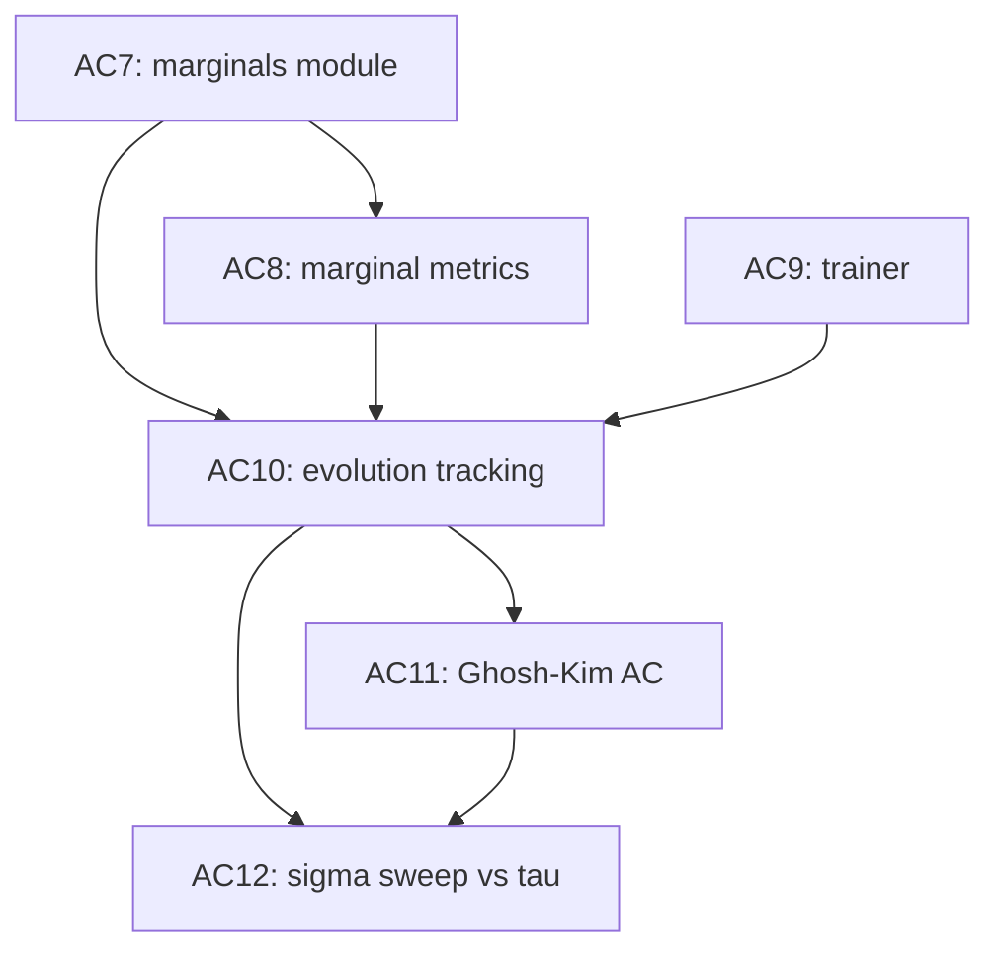

# Design Decisions — AC7 to AC12

> [!abstract] What this note is
> The supervisor pointed out two gaps after reading `docs/papers/2503.02934v2 (3).pdf` (Ghosh–Kim) and `docs/papers/2305.02881v2.pdf` (Rudolph): (1) we have never checked [[Anti-Concentration|anti-concentration]] on a *trained* IQP distribution, and (2) we have never measured whether learned [[#Marginal|marginals]] agree with target marginals — nor how that agreement evolves during training, nor how it depends on the MMD [[Gaussian Convention|bandwidth $\sigma$]]. This note records the design decisions that turned those two questions into six new TODOs (`AC7`–`AC12`) and the execution waves that sequence them.
>
>
> **Implementation status (2026-04-19):** `AC7`–`AC10` shipped and tested; `AC11`–`AC12` configs checked in but sweeps not yet run. See [[AC7 to AC12 Implementation]] for the post-implementation review and supervisor FAQ.
>
> **Framing update (2026-04-19, post-review):** the supervisor's "anti-concentration" language conflates two distinct properties. The real question is agreement on high-order marginals, and the learned distributions in the paper under scrutiny almost certainly pass strict AC trivially (they are *smoother* than their targets). See [[Anti-Concentration vs Marginal Agreement]] — it sharpens how `AC11`/`AC12` are reported and adds a target-power-spectrum diagnostic.

---

## 1. The Supervisor's Two Questions

> [!important] Verbatim
> "You should be looking at whether the distributions learned in the paper ([`docs/papers/2503.02934v2 (3).pdf`](../docs/papers/2503.02934v2%20(3).pdf)) were anti-concentrated or not. Along these lines, there is another interesting question which we should look at, which is whether the learned distribution coincides with the ideal one on high marginals and how marginals evolve during training. This should be closely related to the bandwidth and has already been discussed in this paper [arXiv:2305.02881](https://arxiv.org/abs/2305.02881) ([`docs/papers/2305.02881v2.pdf`](../docs/papers/2305.02881v2.pdf)) but also related to the data itself."

Decomposed into two independent investigations:

| # | Question | Answered by |
|---|---|---|
| Q1 | Are the learned distributions (from the Ghosh–Kim paper regime) anti-concentrated? | `AC11` |
| Q2 | Does the learned distribution match the target on high marginals, and how does that evolve during training — as a function of bandwidth? | `AC7`, `AC8`, `AC10`, `AC12` |

`AC9` (training loop) is the enabler — without it, there is no "during training" to measure.

---

## 2. Prerequisite Facts (Verified Before Planning)

> [!info] What the codebase has vs. does not have
> Verified during exploration on 2026-04-19.

- ✅ [[Anti-Concentration]] checker — `check_anti_concentration` in [`src/iqp_bp/experiments/run_validation.py`](../src/iqp_bp/experiments/run_validation.py) works on exact prob vectors, sample histograms, and loaded [[IQP Model|IQP models]].
- ✅ Exact probability vector — `IQPModel.probability_vector_exact(max_qubits=20)` via [[Walsh-Hadamard Transform]].
- ✅ Analytic MMD² gradient — `grad_expectation_analytic` in [`src/iqp_bp/mmd/gradients.py`](../src/iqp_bp/mmd/gradients.py).
- ✅ Gaussian spectral weight $\tau^{|S|} = \tanh^{|S|}(1/(4\sigma^2))$ — `gaussian_spectral_weights` in [`src/iqp_bp/mmd/kernel.py`](../src/iqp_bp/mmd/kernel.py). This is exactly the Rudolph weight.
- ❌ **No training loop anywhere.** `.npz` checkpoints exist but nothing updates $\theta$ via gradient descent.
- ❌ **No marginal code anywhere.** The word `marginal` appears in [[Learning Task]] and [[Kernel Spectral Decomposition]] but never in `src/`.

These two gaps are why the plan needs an `AC7` (marginals) and an `AC9` (trainer) before the supervisor's questions can be answered.

---

## 3. Decision Log

Each decision below was made with an explicit alternative on the table. If we ever revisit the plan, start by asking whether the decision's *why* still holds.

### Decision 1 — Scope of `AC11` (Ghosh–Kim learned-distribution AC)

> [!note] Chosen: both small-$n$ exact **and** large-$n$ sampled
> **Alternatives considered:** small-$n$ reproduction only; sample-histogram proxy at larger $n$ only.

**Why:** Ghosh–Kim train up to ~1000 qubits; we cannot load their checkpoints or reproduce their full regime. But the anti-concentration question is a *distribution-shape* question, and distribution shape can change with $n$. An exact small-$n$ answer alone would not rule out that AC collapses at scale; a sampled large-$n$ answer alone would not rule out that we misread the histogram mode. Doing both gives us:

- Exact `scaled_second_moment` and $\hat\beta(\alpha)$ for $n \le 12$ with no sampling ambiguity.
- One larger-$n$ run (target $n \in \{20, 30\}$ under a wall-clock cap) with the existing sample-histogram AC mode, clearly labeled as a *secondary* diagnostic per the [[Anti-Concentration]] convention.

**How to apply:** the `AC11` config set is two files, `configs/experiments/ghosh_kim_small_n.yaml` and `configs/experiments/ghosh_kim_large_n_sampled.yaml`, emitting separate artifact subfolders. Supervisor presentation side-by-sides both panels.

### Decision 2 — Meaning of "high marginals"

> [!note] Chosen: all orders $|S| \in \{1, \ldots, n\}$, stratified
> **Alternatives considered:** $|S| \ge n/2$ only; $|S| \in \{1, 2, n\}$ only.

**Why:** The supervisor's phrase "high marginals" is ambiguous, and the supervisor-meaning ("does the learned distribution capture the hard, high-body correlations?") is best demonstrated *against* the low-body baseline, not in isolation. Stratifying by order also gives us the clean comparison with Rudolph's $\tau^{|S|}$ weight: the theoretical prediction is *per order*, so the empirical curve should be per order too.

**How to apply:** `summarize_by_order` in `AC8` defaults `orders = range(1, n+1)`. When $\binom{n}{k}$ exceeds `max_subsets_per_order`, uniformly sample subsets without replacement at that order. High orders (near $n$) must be first-class citizens in the output — not truncated away to save compute.

### Decision 3 — Gradient backend for the trainer

> [!note] Chosen: build on existing analytic gradient now, swap to JAX later behind the same interface
> **Alternatives considered:** block `AC9` until `V3` (JAX autodiff) lands.

**Why:** `grad_expectation_analytic` already exists, is tested, and supports batching. Making `AC9` wait for `V3` would delay `AC10`–`AC12` — which are the todos that actually answer the supervisor's questions — for no correctness gain. The trainer interface must stay gradient-backend-agnostic so `V3` can swap in later without touching the optimizer or the trajectory writer.

**How to apply:** the `Trainer` class in `src/iqp_bp/training/trainer.py` takes the gradient estimator as an injected dependency. Any function with the signature of `grad_mmd_squared_analytic` is a valid backend.

---

## 4. The Six New TODOs

Add to [[TODO Roadmap]] and `TODOS.md` under the existing [[Anti-Concentration]] track.

### AC7 — Marginal computation module

A self-contained math module for marginals and Fourier coefficients over exact probability vectors (small $n$) and empirical samples (any $n$).

- `exact_marginal(p, subset)`, `sample_marginal(samples, subset)`
- `exact_fourier_coefficient(p, a)`, `sample_fourier_coefficient(samples, a)`
- `enumerate_subsets(n, order, max_subsets, rng)` — enumerate when tractable, sample otherwise
- Tests: Fourier↔pmf identity, exact↔sample convergence, marginal normalization

**Path:** `src/iqp_bp/distributions/marginals.py` (new). Reuses [[IQP Model|`probability_vector_exact`]].

### AC8 — Marginal-mismatch metrics, aggregated by order

- TV, $\chi^2$, and squared-Fourier-error metrics on marginals
- `summarize_by_order` reports per-order mean/median/max mismatch *and* the `τ^|S|`-weighted MMD² contribution at the current $\sigma$
- Output must include high orders as first-class citizens

**Depends on:** `AC7`. **Path:** `src/iqp_bp/distributions/marginal_metrics.py` (new).

### AC9 — Minimal MMD training loop

A `Trainer` class built on the existing analytic gradient. Persists `(step, θ, loss, wall_clock)` to a JSONL trajectory, plus `.npz` checkpoints at every persisted step (reuses `save_iqp_checkpoint`). Wires a new `run-training` CLI subcommand and a `training:` block in the [[Config|config schema]].

**Depends on:** nothing. **Paths:** `src/iqp_bp/training/trainer.py`, `src/iqp_bp/experiments/run_training.py`, `configs/experiments/training_smoke.yaml`, plus CLI + schema updates.

### AC10 — Marginal + AC evolution tracking on the trajectory

At every persisted training step, the runner:

1. Computes the exact prob vector (small $n$) or draws $M$ samples.
2. Runs `check_anti_concentration` on that distribution → `ac_*` fields.
3. Runs `summarize_by_order` against the target → per-order marginal mismatch.
4. Appends one row to the trajectory JSONL.

**Depends on:** `AC7`, `AC8`, `AC9`. **Path:** `src/iqp_bp/experiments/marginal_artifacts.py` (new, mirrors the existing AC artifact writer).

### AC11 — Ghosh–Kim learned-distribution AC (exact + sampled)

Train on Ghosh–Kim-style settings at two scales. Report AC at init and at end of training, per $\sigma \times$ family cell. Call out any settings where training *loses* anti-concentration.

- Small-$n$ exact: `configs/experiments/ghosh_kim_small_n.yaml` — `n ≤ 12`, exact AC path
- Large-$n$ sampled: `configs/experiments/ghosh_kim_large_n_sampled.yaml` — one run, sample-histogram AC
- Write-up: subsection in [[Anti-Concentration]] (and in `docs/technical/anti-concentration.md`)

**Depends on:** `AC10`, [[Ising Dataset]] / [[Binary Mixture Dataset]] factories (already complete), [[IQP Model|provenance]] (already complete).

### AC12 — Bandwidth sweep: marginal matching vs $\sigma$, tied to Rudolph $\tau^{|S|}$

Sweep $\sigma$ over a grid covering Rudolph's regimes ($\sigma = \Theta(1)$, $\Theta(\sqrt n)$, $\Theta(n)$). For each $\sigma$, record per-order marginal TV at end of training; plot against the theoretical weight $\tau(\sigma)^k$.

- Config: `configs/experiments/bandwidth_marginal_sweep.yaml`
- Artifacts: `data/results/bandwidth_marginal_sweep/`
- New note: [[Bandwidth Marginals]] (stub until written; see `docs/technical/bandwidth-marginals.md`)

**Depends on:** `AC10`, `AC11`.

---

## 5. Execution Waves

| Wave | Todos | Runs in parallel? |
|---|---|---|
| A | `AC7`, `AC9` | Yes — different sessions |
| B | `AC8` | Sequential after A |
| C | `AC10` | Sequential after B |
| D | `AC11`, `AC12` | `AC12` can start once `AC11` has one σ × family cell done |

---

## 6. Verification / Acceptance

> [!success] Definition of done
> The supervisor's two questions must have artifact-backed answers in the vault.

- **Per-todo tests:** each todo ships with its own test file. `pytest tests/test_marginals.py tests/test_marginal_metrics.py tests/test_trainer.py tests/test_run_training.py` must pass.
- **End-to-end smoke:** `python -m iqp_bp.cli run-training -c configs/experiments/training_smoke.yaml` produces a trajectory JSONL with `ac_*` fields and per-order marginal summaries on every persisted step. Should complete in < 60s on CPU at $n = 6$.
- **Q1 artifact:** `data/results/ac_ghosh_kim/summary.md` (auto-generated) states pass/fail AC per $\sigma \times$ family cell with exact `scaled_second_moment` and $\hat\beta(1)$ for small $n$, plus sampled equivalents for the large-$n$ cell.
- **Q2 artifact:** `data/results/bandwidth_marginal_sweep/marginal_vs_sigma.png` + [[Bandwidth Marginals]] write-up making the empirical-vs-theoretical $\tau^{|S|}$ comparison explicit.

---

## 7. Critical Files

**Reuse (no changes):**

- `IQPModel.probability_vector_exact` — [`src/iqp_bp/iqp/model.py`](../src/iqp_bp/iqp/model.py)
- `check_anti_concentration`, `write_anti_concentration_artifacts`, `save_iqp_checkpoint` — [`src/iqp_bp/experiments/run_validation.py`](../src/iqp_bp/experiments/run_validation.py)
- `grad_expectation_analytic`, `grad_mmd_squared_analytic` — [`src/iqp_bp/mmd/gradients.py`](../src/iqp_bp/mmd/gradients.py)
- `gaussian_spectral_weights` — [`src/iqp_bp/mmd/kernel.py`](../src/iqp_bp/mmd/kernel.py) ($\tau^{|S|}$ weight for Rudolph comparison)
- Named [[RNG|RNG streams]] — [`src/iqp_bp/rng.py`](../src/iqp_bp/rng.py)
- Resolved-config / manifest persistence — [[Scaling Runner|`run_scaling.py`]] (same pattern copied into `run_training.py`)

**New modules:**

- `src/iqp_bp/distributions/marginals.py`
- `src/iqp_bp/distributions/marginal_metrics.py`
- `src/iqp_bp/training/trainer.py`
- `src/iqp_bp/experiments/run_training.py`
- `src/iqp_bp/experiments/marginal_artifacts.py`
- `tests/test_marginals.py`, `tests/test_marginal_metrics.py`, `tests/test_trainer.py`, `tests/test_run_training.py`

**Updated:**

- `src/iqp_bp/cli.py` — new `run-training` subcommand
- `src/iqp_bp/config.py` + `configs/schema.yaml` — new `training:` block
- `configs/experiments/training_smoke.yaml`, `ghosh_kim_small_n.yaml`, `ghosh_kim_large_n_sampled.yaml`, `bandwidth_marginal_sweep.yaml` (new)
- `docs/technical/anti-concentration.md` — append AC11 findings
- `docs/technical/bandwidth-marginals.md` — new (AC12)
- `TODOS.md` — insert AC7–AC12 under the AC track

---

## 8. Glossary

### Marginal

For a probability distribution $p(x)$ over $\{0,1\}^n$ and a subset $S \subseteq [n]$, the **marginal** is the distribution over $\{0,1\}^{|S|}$ obtained by summing $p$ over the unfixed qubits:

$$
p_S(x_S) = \sum_{x_{\bar S}} p(x)
$$

Equivalently, in the Walsh/Fourier basis, marginals are encoded by the coefficients $\langle Z_T \rangle_p$ for $T \subseteq S$.

### High marginal

In this plan, **high marginal** means any $|S|$ close to $n$ (practically, $|S| \ge n/2$). Low marginals = single-qubit ($|S|=1$) and pairwise ($|S|=2$). MMD² with bandwidth $\sigma$ and weight $\tau^{|S|}$ increasingly *suppresses* high marginals as $\sigma \to \infty$.

### $\tau^{|S|}$ weight (Rudolph)

From [[Kernel Spectral Decomposition]] and [[Gaussian Convention]]:

$$
\tau = \tanh\!\left(\frac{1}{4\sigma^2}\right), \qquad
k_\sigma(x, y) = C \sum_S \tau^{|S|} \chi_S(x)\chi_S(y)
$$

This is the theoretical curve `AC12` overlays on the empirical per-order marginal mismatch.

---

## 9. Related

- [[Anti-Concentration]] — the definitions + deterministic diagnostics already in place (`AC1`–`AC6`)
- [[Weekly Task - Anti-Concentration]] — the supervisor-facing writeup for the next meeting
- [[Presentation - Anti-Concentration]] — slides that the AC11/AC12 results will eventually feed into
- [[Validation Runner]] — the existing AC artifact writer pattern `AC10` mirrors
- [[Scaling Runner]] — the existing resolved-config/manifest pattern `AC9` mirrors
- [[Gaussian Convention]] — the locked $\tau$ convention
- [[Kernel Spectral Decomposition]] — the Walsh-basis MMD² identity
- [[Learning Task]] — the training-target framing supervised by MMD²
- [[TODO Roadmap]] — dependency-ordered task list
- [[Planning MOC]] — the planning-docs index
- [[References#Paper 2503.02934]] — Ghosh–Kim
- [[References#Paper 2305.02881]] — Rudolph
