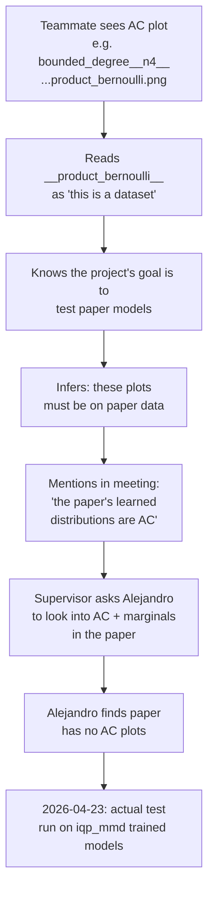

# Misattributed AC Plots — Forensic Report

> [!abstract] What this note is
> A teammate claimed that anti-concentration plots shown in a recent meeting came from `notebooks/01_scaling_plots.ipynb` and were stored under `../results/scaling_v1/anti-concentration`, and — downstream of that — that those plots were generated from the data in the [[References#Paper 2503.02934|Recio-Armengol "Train on classical, deploy on quantum" paper]]. That chain of attributions is wrong at every step. This note catalogs exactly what is and is not on disk, where every pre-2026-04-23 AC plot actually came from, and the most likely mis-attribution path. It exists so nobody repeats this confusion.

> [!danger] Headline
> - The path `results/scaling_v1/anti-concentration` **does not exist** (and never has, per `git log`).
> - `notebooks/01_scaling_plots.ipynb` does **not** produce any AC plots — it only plots gradient variance vs. `n`.
> - Every AC plot in the repo prior to **2026-04-23** was computed on a **synthetic** dataset (`product_bernoulli` or `binary_mixture`), on either random IQP circuits or our own `iqp_bp` trainer — **not on the paper's trained models**.
> - The Recio-Armengol paper itself contains **no** AC plots or diagnostics (see [[Anti-Concentration vs Marginal Agreement#3. Reading Recio-Armengol, Ahmed & Bowles (2503.02934) in This Light]]).
> - The first and currently only AC analysis on actual `iqp_mmd`-trained models is [[iqp_mmd AC Investigation 2026-04-23]], completed 2026-04-23.

---

## 1. The claimed artifact does not exist

```
results/scaling_v1/                    ← does NOT exist on disk
results/scaling_v1/anti-concentration  ← does NOT exist
git log --all -- 'results/scaling_v1/**'  ← returns nothing (never committed)
```

What **does** exist is `configs/experiments/scaling_v1.yaml` (a scaling-trainability experiment config) and a corresponding notebook that would write to `results/scaling_v1/figures/` if the experiment were run. Nobody has run it on this machine — nothing under `results/scaling_v1/` is on disk.

## 2. `01_scaling_plots.ipynb` does not produce AC plots

A keyword sweep of the notebook for `anti|concentration|beta_hat|scaled_second|heavy|ac_|collision|second moment` returns ==zero AC-related code==. The only hits are incidental (e.g. the word "polynomial" as a kernel type label).

What the notebook actually does:

| Dimension | Value |
|---|---|
| Input | `../results/scaling_v1/results.jsonl` (trainability JSONL from `run-scaling`) |
| Output | `../results/scaling_v1/figures/variance_vs_n_{family}.pdf` |
| Y-axis | `log(var(∂L/∂θ))` — gradient variance |
| X-axis | `n` — qubit count |
| Purpose | Check for barren plateau via scaling of gradient variance with `n` |

There is no AC curve, no `β̂(α)`, no scaled second moment, no heavy-output calculation, no marginal TV. None of these quantities are even imported into the notebook's namespace.

## 3. The AC plots that actually exist in `results/`

All four pre-2026-04-23 sources, cross-checked against their provenance:

| Directory | Data | Circuit family | θ source | Trained? | Tied to paper? |
|---|---|---|---|:---:|:---:|
| `results/scaling_ac_diverse/anti_concentration/` | **product_bernoulli** (synthetic, 128 samples, uniform bit frequencies) | bounded_degree, product_state, complete_graph, erdos_renyi | `uniform`, `small_angle(std=0.01)` | ❌ untrained — random init | ❌ |
| `results/scaling_ac_holdout_families/anti_concentration/` | **product_bernoulli** | lattice, dense, community, symmetric | `uniform`, `small_angle` | ❌ | ❌ |
| `results/scaling_ac_holdout_n/anti_concentration/` | **product_bernoulli** | product_state, complete_graph, erdos_renyi, bounded_degree | `uniform`, `small_angle` | ❌ | ❌ |
| `results/bandwidth_marginal_sweep/figures/` (`ac_trajectory.png`, `m_k_heatmap.png`) | **binary_mixture** (synthetic 20-peak mixture at `n=9`) | lattice | `iqp_bp`'s own trainer (Adam, 20 steps, exact-mode loss) | ✅ but by **our** trainer — not `iqpopt` | ❌ |
| `results/exploration/anti_concentration_n3.json` | toy n=3 | product_state | manual | ❌ | ❌ |

Representative provenance block from `results/scaling_ac_diverse/anti_concentration/bounded_degree__n4__gaussian__uniform__product_bernoulli__sigma1p0.json`:

```json
{
  "provenance": {
    "bandwidth": 1.0,
    "dataset_type": "product_bernoulli",
    "family": "bounded_degree",
    "init": "uniform",
    "kernel": "gaussian",
    "n": 4,
    "source": "scaling_seed",
    "theta_seed_index": 0
  }
}
```

> [!important] `"source": "scaling_seed"` means **no training happened**
> The θ was generated from the `init` scheme (uniform on $[-\pi, \pi]$ or small-angle Gaussian with `std=0.01`), fed into `probability_vector_exact`, and the resulting distribution was passed to `check_anti_concentration`. The purpose of these runs — literally per the config docstring in `configs/experiments/scaling_ac_diverse.yaml` — is *"label source for F3 plateau_agreement Forge runs."* They exist to tag Forge agreement rows with AC pass/fail, not to say anything about trained models or about the paper.

## 4. None of this touches the paper's datasets

The Recio-Armengol paper uses seven datasets:

`8_blobs`, `2D_ising`, `spin_glass`, `scale_free`, `MNIST`, `genomic-805`, `dwave`.

A full `results/` search:

- `product_bernoulli` appears in hundreds of filenames (the synthetic stand-in used for all scaling experiments).
- `binary_mixture` appears in `results/bandwidth_marginal_sweep/` (our AC11/AC12 sandbox target at n=9).
- **The paper's dataset names (`blobs`, `ising`, `genomic`, `mnist`, `dwave`, `scale_free`) appear only under `results/iqp_mmd_ac_investigation/`** — the 2026-04-23 runs documented in [[iqp_mmd AC Investigation 2026-04-23]].

## 5. Most likely chain of mis-attribution



Alternative path: the `bandwidth_marginal_sweep` AC11/AC12 outputs (`ac_trajectory.png`, `m_k_heatmap.png`) were conflated with the paper. Those are on `binary_mixture` at n=9 via our own `iqp_bp` trainer — same mis-attribution risk since nothing on those plots visibly says "this is not paper data."

## 6. What is actually true

> [!success] The real AC story as of 2026-04-23
> - The paper tests nothing about anti-concentration or high-order marginal agreement.
> - This repo had produced AC plots only on synthetic distributions or untrained random circuits.
> - The [[iqp_mmd AC Investigation 2026-04-23|2026-04-23 runs]] are the first to actually train via `iqp_mmd`'s (= paper's) stack and then evaluate AC + per-order TV. Answer: not AC; Ising matches target at every order, blobs only at low orders. See that note for full caveats.

## 7. What to say to the supervisor

> [!quote] Suggested wording
> "My colleague's attribution was incorrect on three counts. The path he named (`results/scaling_v1/anti-concentration`) does not exist; `notebooks/01_scaling_plots.ipynb` only produces gradient-variance plots and no AC content; and every AC plot that does exist in the repo prior to 2026-04-23 was generated on synthetic `product_bernoulli` or `binary_mixture` distributions using either random initializations or our own in-house trainer — **none** were on the paper's trained models. The paper itself contains no AC diagnostics. As of 2026-04-23 we have run the AC + high-order-marginal test directly on `iqp_mmd`-trained checkpoints for the two smallest paper datasets (`2D_ising` and `8_blobs` at n=16); results are in `results/iqp_mmd_ac_investigation/` and written up in the vault under [[iqp_mmd AC Investigation 2026-04-23]]."

## 8. Process takeaway

> [!tip] How to avoid this next time
> 1. **AC plot filenames should include the dataset explicitly.** `..._product_bernoulli_...` should read as "synthetic placeholder, not trained data" — but it didn't. Consider renaming to `..._untrained_product_bernoulli_...` or `..._random_init_...` for outputs of the `scaling_ac_*` configs.
> 2. **Each AC output JSON should carry a `purpose` field** ("forge agreement labels" vs. "paper reproduction" vs. "sandbox trajectory"). The provenance block has the information but it's spread across several keys.
> 3. **Meeting slides showing AC curves should caption the data source** in the figure — not just the plot filename.
> 4. **Before citing a plot to the supervisor, open the JSON sidecar and verify `provenance.dataset_type` and `provenance.source`.** Three seconds, saves a week of confusion.

---

## 9. Related

- [[iqp_mmd AC Investigation 2026-04-23]] — the first actual AC test on paper-trained models.
- [[iqp_mmd AC Investigation - Plain English Walkthrough]] — Feynman-style explainer of the same.
- [[Codex Audit - spin_sym Export Gap]] — the bridge bug Codex caught in the investigation above.
- [[Anti-Concentration vs Marginal Agreement]] — the theoretical framing: why these are two questions.
- [[AC12 Bandwidth Sweep Results 2026-04-21]] — the `binary_mixture` sandbox whose plots are another likely confusion target.
- [[Anti-Concentration]] — AC-theory hub.

---

## Appendix A — Commands used to verify each claim

```bash
# Check the claimed path does not exist
ls -la results/scaling_v1/                             # No such file or directory
ls -la results/scaling_v1/anti-concentration           # No such file or directory
git log --all -- 'results/scaling_v1/**'               # (no history)

# Notebook content sweep
rg -i "anti|concentration|beta_hat|scaled_second|heavy|ac_|collision" \
     notebooks/01_scaling_plots.ipynb                  # only incidental matches

# Where the actual AC plots live + their data source
find results -type d -iname "*anti*conc*"
# results/scaling_ac_diverse/anti_concentration
# results/scaling_ac_holdout_families/anti_concentration
# results/scaling_ac_holdout_n/anti_concentration

# Inspect provenance of each directory
python -c "import json; d=json.load(open('results/scaling_ac_diverse/anti_concentration/bounded_degree__n4__gaussian__uniform__product_bernoulli__sigma1p0.json'));
           p=d['provenance']; print(p['dataset_type'], p['family'], p['source'])"
# → product_bernoulli bounded_degree scaling_seed
```

%%
Change log:
- 2026-04-23: initial write-up after forensic investigation.
%%
