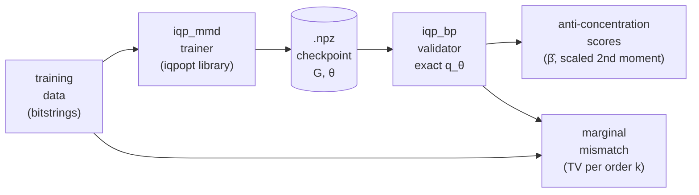

# iqp_mmd AC Investigation — Plain English Walkthrough

> [!abstract] Who this note is for
> A teammate who has never touched the project and wants to understand — in plain language, no quantum background — what the 2026-04-23 investigation actually did and why. The formal write-up is in [[iqp_mmd AC Investigation 2026-04-23]]. This note is the "tell it to me like I'm a smart 15-year-old" version.

---

## 1. The question, in one paragraph

The supervisor wants to know two things about a specific family of quantum machine-learning models (`iqp_mmd`, which faithfully implements the Recio-Armengol et al. "Train on classical, deploy on quantum" paper):

1. **Are its learned probability distributions "spread out enough"** that the theoretical hardness arguments for quantum sampling still apply? ==(anti-concentration)==
2. **When we look at small groups of its outputs, do they statistically agree with the training data** — not just on single qubits, but on pairs, triples, and bigger subgroups? ==(high-order marginal agreement)==

A teammate thought the paper already answered these. It didn't. We had to actually compute them.

---

## 2. The setup, in pictures

Three pieces of code we already had:
- **The paper's training code** (`iqpopt`, external library). Given data, it spits out a trained `θ`.
- **Our validator** (`iqp_bp`). Given `(G, θ)`, it computes the exact probability of every bitstring and checks anti-concentration.
- **A bridge** (`iqp_mmd/checkpoint_export.py`) that saves `(G, θ)` in a format the validator can read.

One piece we had to write:
- A **per-order marginal mismatch** function that, for each subset size `k`, averages the total-variation distance between the learned and target distributions across random `k`-subsets of qubits.

---

## 3. What each step does — as simply as possible

### Step 1: "Make a small toy target."
For **Ising**: run a dumb Markov-chain simulation of 16 spins on a 4×4 grid, magnets that like to align with their neighbours. Boil the simulation at a warm-enough temperature so patterns don't freeze in. Dump 5000 snapshots, each a 16-bit binary string.

For **spin_blobs**: pick 20 random 16-bit "peak" strings. Produce 3000 samples by starting from a random peak and flipping each bit with 5% probability.

==Why two datasets?== Because they tell different stories. Ising looks like gentle noise around a pattern — easy for a smooth model to fit. Blobs is multi-modal — hard.

### Step 2: "Teach a quantum circuit to imitate the target."
Build an **IQP circuit**: a very specific quantum circuit shape (Hadamard sandwich around a diagonal phase layer). Put 2516 tunable angles `θ` inside it. Train them with gradient descent, using an **MMD loss** — a distance that says "your samples should look statistically like my samples."

Nothing fancy happens here on the conceptual side. The quantum circuit is just a parameterized family of probability distributions over 16-bit strings. Training finds a setting of `θ` that makes the circuit's output distribution close to the data in the MMD sense.

> [!info] MMD in one sentence
> Maximum Mean Discrepancy compares two distributions by how differently they weight each Pauli-`Z` correlation; with a Gaussian kernel, short-range correlations matter most and long-range correlations are suppressed. This is the main `σ`-knob the paper tunes.

### Step 3: "Save the circuit deterministically."
`iqpopt` stores the gate list + angles as Python objects. Our validator expects a plain `(G, θ)` tuple where `G` is a binary matrix (one row per gate, one column per qubit, `1` if the gate touches that qubit). Convert and save as `.npz`.

==Gotcha==: this step ==silently loses one knob== (`spin_sym`). That caused a bug — see [[#6. The hiccup Codex caught]] below.

### Step 4: "Compute the exact output distribution of the trained circuit."
At `n = 16` there are only `2^16 = 65,536` possible outputs, so we can enumerate them all. For each bitstring `z`, the IQP circuit gives probability `|⟨z| Hadamard · diagonal_phase · Hadamard |0⟩|²`. We compute this exactly — no sampling. Output: a 65,536-dimensional vector `q_θ` that sums to 1.

### Step 5: "Score anti-concentration."
Two numbers matter:
- **Scaled second moment**: `2^n × Σ q(x)²`. For a uniform distribution this is exactly 1. For a distribution that puts all mass on one string, this is `2^n = 65,536`. Anywhere in between: the larger, the more concentrated.
- **β̂(α)**: "what fraction of bitstrings get probability at least `α/2^n`?" The paper of Bremner–Montanaro–Shepherd says an anti-concentrated distribution must have `β̂(α=1) ≥ some constant`. We test against `0.25`.

Run this on both the learned `q_θ` and the empirical target histogram `p_emp`.

### Step 6: "Score marginal agreement, order by order."

> [!tip] What "marginal of order k" means
> Pick any `k` qubits out of 16. Ignore the rest — sum them out. What you get is a probability distribution over just those `k` bits. This is called the **marginal** on that subset.
>
> For `k = 1`: one bit. 2 possible values. Just asks "what's the average value of bit 5?"
>
> For `k = 2`: two bits. 4 values. Asks "how often do bits 5 and 12 both equal 1?" — a pairwise correlation.
>
> For `k = n = 16`: all bits. This is the full joint distribution.
>
> Good marginal agreement at low `k` means the two distributions agree on simple summary stats. Agreement at high `k` means they agree on complicated joint patterns. High-`k` agreement implies low-`k` agreement; the reverse is not true.

For each `k ∈ {1, 2, …, 16}`, pick up to 128 random subsets. Compute the marginal of `q_θ` and of `p_emp` on that subset. Take total-variation distance. Average over subsets. Plot vs. `k`.

Repeat with `q_θ` replaced by uniform — this is our "dumb baseline." The learned model should beat it; the question is by how much.

---

## 4. What we found (after the fix)

> [!success] The numbers
>
> **Anti-concentration (both fail strict test):**
>
> | Dataset | scaled 2nd moment | β̂(α=1.0) |
> |---|---:|---:|
> | Ising `q_θ` | 3857 | 0.058 |
> | Blobs `q_θ` | 43 | 0.168 |
> | uniform (reference) | 1 | 1.0 |
>
> **Marginal mismatch (Ising matches everywhere, blobs only at low k):**
>
> | `k` | Ising learned | Ising uniform | Blobs learned | Blobs uniform |
> |---:|---:|---:|---:|---:|
> | 1 | **0.005** | 0.005 | **0.010** | 0.106 |
> | 4 | **0.026** | 0.536 | 0.127 | 0.302 |
> | 8 | **0.072** | 0.694 | 0.415 | 0.637 |
> | 16| **0.291** | 0.978 | **0.789** | 0.987 |
>
> On ==Ising== the learned `q_θ` reproduces the target at **every** order — TV under 0.08 through `k = 8`. On ==blobs== it reproduces low `k` only; TV passes 0.4 by `k = 8`.

### 4.1 In one sentence each

- ==No==, the learned distributions are **not** anti-concentrated. They pile mass onto a small fraction of outcomes. Both datasets.
- ==Partly yes== on marginals: for a **smoothly-correlated** target like Ising the circuit matches at every order; for a **multi-modal** target like blobs it matches low orders but loses high orders.

### 4.2 Why that's not surprising

The training loss is MMD with Gaussian kernel at `σ ∈ {0.6, 1.3}`. Rudolph et al. (`2305.02881`) proved this kernel acts as a **low-pass filter on Pauli weight** — it can only pressure the model to agree at low Pauli weights. Ising's correlations are low-Pauli-weight by nature (gentle grid structure); blobs has high-Pauli-weight structure (20 distinct peaks). See [[Anti-Concentration vs Marginal Agreement#2. What Rudolph Actually Predicts]].

In other words: **we expected this outcome**, but now we have direct evidence on the paper's own stack.

---

## 5. What about the other 5 datasets in the paper?

Can't do this analysis on them. `2D_ising` and `8_blobs` are the only ones with `n ≤ 20`. The rest are `n ∈ {256, 484, 784, 805, 1000}`, where `2^n` outputs can't be enumerated. Those need a different technique (the paper's own Proposition 1 gives a way to estimate individual `⟨Z_a⟩` expectations classically). Not done here. See [[iqp_mmd AC Investigation 2026-04-23#8. What this doesn't answer (honest limits)|§8]] of the main write-up.

---

## 6. The hiccup Codex caught

Before shipping, we ran Codex in adversarial mode: *"try to break this investigation."* Codex found something we would have missed: the validator we used (`iqp_bp`) doesn't know about a flag called `spin_sym` that the trainer (`iqpopt`) uses to keep the Ising model symmetric under flipping every bit. Our validator was effectively computing the distribution of an **un-symmetrised** version of the Ising circuit.

Concretely: when we loaded the saved Ising checkpoint into the validator, the exact distribution it computed had `TV = 0.258` from the **actual** trained distribution. That's a huge gap — equivalent to looking at the wrong model entirely.

Fix: instead of using the validator's own exact-probability routine, compute `q_θ` directly from `iqpopt` (which does respect `spin_sym`), and feed that into the anti-concentration and marginal diagnostics. Trivial code change, no retraining needed. The corrected Ising numbers are in the table above.

Full investigation record: [[Codex Audit - spin_sym Export Gap]].

> [!quote] Lesson
> Before trusting a pipeline that glues two tools together, always run a **round-trip sanity test** — compute the same thing on both sides and check they match. We skipped that step initially and it cost us.

---

## 7. Caveats in plain English

Before anyone cites these numbers, read this.

- **Small experiment.** Only two of the paper's seven datasets. Only `n = 16`.
- **Under-trained.** The paper runs 10,000 training steps. We ran 1,000. Especially visible on blobs (loss still descending).
- **Reduced model for blobs.** The paper uses gates with up to 6-qubit support. We used gates up to 4-qubit support because 6 ran out of RAM on this laptop.
- **Home-made data.** Our Ising data came from a quick Gibbs sampler, not the paper's cached CSV. Same distribution family, not the same samples.
- **The `β̂ ≥ 0.25` threshold is arbitrary.** One project spec uses `0.1` elsewhere. Saying "fails at the chosen threshold" is fair; saying "isn't anti-concentrated" in general is too strong.

These caveats do **not** change the qualitative answer — learned distributions are concentrated; Ising agrees at all orders; blobs loses high orders. They do mean you shouldn't quote precise numbers out of context.

---

## 8. Where the files live

- **Investigation script:** `scripts/investigate_iqp_mmd_ac.py`
- **Correction script (bypasses the spin_sym bug):** `scripts/rerun_ac_via_iqpopt.py`
- **Round-trip test that caught the bug:** `scripts/_verify_checkpoint_faithful.py`
- **Results (use the `*_CORRECTED.json`):** `results/iqp_mmd_ac_investigation/`
- **Headline plot:** `results/iqp_mmd_ac_investigation/ac_and_marginals_summary.png`
- **Codex transcript:** `results/codex_challenge.jsonl`

---

## 9. The one-slide summary (for Monday)

> [!quote] One-paragraph answer to the supervisor
> "On the two paper datasets small enough for exact enumeration (`n = 16`), the `iqp_mmd` learned distributions are **not** anti-concentrated in the strict `β̂ ≥ 0.25` sense — their scaled second moments are 43 (blobs) and 3857 (Ising), far above the uniform value of 1. On high-order marginal agreement the answer is dataset-dependent: on Ising the learned distribution matches the target at every order we can check (TV < 0.08 through `k = 8`, 0.29 at `k = 16`); on blobs it matches low orders (TV < 0.05 for `k ≤ 2`) but loses high-order structure (TV > 0.4 by `k = 8`). This matches the Rudolph prediction that low-`σ` MMD can only enforce low-Pauli-weight marginal agreement. Caveats in [[iqp_mmd AC Investigation 2026-04-23#8. What this doesn't answer (honest limits)|§8 of the main writeup]]."

---

## 10. Related

- [[iqp_mmd AC Investigation 2026-04-23]] — the full technical write-up.
- [[Codex Audit - spin_sym Export Gap]] — the bug and the fix.
- [[Anti-Concentration vs Marginal Agreement]] — why these are two questions.
- [[AC12 Bandwidth Sweep Results 2026-04-21]] — the sandbox analysis my teammate confused with paper plots.
- [[Anti-Concentration]] — the primary AC-theory note.

%%
Change log:
- 2026-04-23: first draft, written after the Codex audit and fix.
%%
