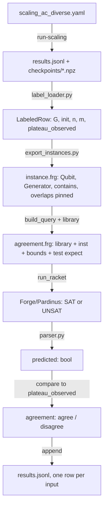

> [!abstract] What this note is
> One-page tour of the Forge side of this project: what Forge is, what the pipeline actually does with it, where the labels come from, the questions it is designed to answer, and what it has told us so far. Start here if you have never opened a `.frg` file. Deep-dive into any specific run via the links at the bottom.

# Forge Pipeline Overview

> [!summary] Closing report
> Final Forge conclusions are summarized in [[Final Findings - IQP MMD Barren Plateaus]] and the new structural feature sweep is in [[Pattern Mining Results]]. The frozen F4 predicate remains the baseline; do not reinterpret new mining rows as a replacement predicate unless it is re-frozen and re-scored.

> [!tip] In plain English
> Some quantum circuits are effectively impossible to train. We want to tell which ones will fail before anyone actually trains them.
>
> Our guess is a short rule: "small starting angles, or a big enough circuit that isn't the one specific well-behaved shape, means you'll hit the problem." Forge is the logic tool we use to run that rule on each circuit and see whether it matches reality. The rest of this note is how we wrote the rule, how we tested it, and where it holds up.

## What Forge Is

[Forge](https://forge-fm.org/) is a **bounded model finder** in the [Alloy](https://alloytools.org/) family, implemented as a `#lang` on top of Racket. Think of it as "relational SQL meets propositional logic with a SAT solver underneath." You declare:

- **Sigs** - sets of atoms. Roughly, rows in a table. For example `sig Qubit {}` and `sig Generator { contains: set Qubit, overlaps: set Generator }`.
- **Predicates** - boolean-valued relational formulas over sigs and fields, e.g. `pred bounded_degree[k: Int] { all g: Generator | weight[g] <= k }`.
- **Tests** - assertions of the form `test expect { name: { formula } for <scope> is sat }` that ask the solver either "find me a model" (`is sat`) or "prove no such model exists" (`is unsat`).

You then hand the file to Racket. Forge compiles your formula into a SAT instance, invokes [Pardinus/Kodkod](https://github.com/emina/kodkod), and prints either a witness structure or an unsat verdict.

Two Forge idioms this project uses:

1. **Pinned instances**. The `inst` block lets us fix a sig's atoms and its fields to exact values. `inst my_hypergraph { Qubit = \`Q0 + \`Q1 + ...; contains = \`G0 -> \`Q0 + ...; }` gives Forge zero degrees of freedom in the hypergraph - whatever Python computed is what Forge sees.
2. **Scope declarations**. `for <inst>` reuses the atoms from an inst block; `for exactly m Generator, n Qubit, 8 Int, 0 Experiment` lets Forge synthesize atoms up to the stated bounds and sets integer bitwidth.

The `#lang forge` header on line 1 switches Racket's reader into Forge-mode. Our library, [`forge/models/hypergraph.frg`](../forge/models/hypergraph.frg), is the shared vocabulary every query extends.

> [!tip] Why bounded model finding, not theorem proving
> Forge can only search up to a scope we set (e.g. "n Qubits, m Generators"). That is strictly weaker than a theorem prover - it proves bounded statements, not universal ones. But it is fast, concrete, and gives readable counterexamples. For structural questions about small hypergraphs, that is the right trade.

## What Our Forge Pipeline Does

The runner at [`src/iqp_bp/experiments/run_forge.py`](../src/iqp_bp/experiments/run_forge.py) ([[Forge Runner]]) takes a config, a labeled dataset, and a query-template name, and emits one Forge verdict per row. Two modes:

- **Template search** (F2). No labels. Asks "is it impossible to satisfy bounded_degree[k] AND high_overlap[t] simultaneously at this scope?" `is unsat` is the signal.
- **Plateau agreement** (F3/F4). Labeled. Reads a scaling-run `.jsonl`, reconstructs the exact hypergraph `G` from each `.npz` checkpoint via [[Checkpoint Bridge|`load_iqp_checkpoint`]], pins every atom in an inst block, asks a predicate question, and derives agree/disagree in Python.

Every Forge query this project runs is some variant of that shape. The predicate text itself lives in [`forge/models/hypergraph.frg`](../forge/models/hypergraph.frg); the query template that calls it lives in [`src/iqp_bp/forge/query_templates.py`](../src/iqp_bp/forge/query_templates.py).

> [!info] Label-free scoring
> The F4 pipeline asks Forge two sibling questions per row - "is the predicate true on this pinned instance?" and "is the predicate false?" - and exactly one of them comes back SAT. Python then records the raw `predicted` bool and compares it to the observed plateau label *outside Forge*. This is stricter than the earlier iff-against-label form and removes the risk of a predicate smuggling the label back into the solver.

## How We Came Up With the Data

The whole Forge layer is downstream of a single source of truth: the [[Scaling Runner|scaling runner]]. Each Forge row traces back to one labeled scaling row, and each scaling row carries its exact hypergraph matrix as a `.npz` checkpoint.

### Training label source

[`configs/experiments/scaling_ac_diverse.yaml`](../configs/experiments/scaling_ac_diverse.yaml) sweeps:

- **Families**: `product_state`, `complete_graph`, `erdos_renyi`, `bounded_degree` (4)
- **Qubits**: `n` in {4, 6, 8}
- **Init schemes**: `uniform` (theta ~ U[-pi, pi]), `small_angle` (theta ~ N(0, 0.01^2))
- **Seeds**: 2 per setting, 5 `param_idx` per seed on average

Yields 111 rows. For each row the runner:

1. Samples `G` from the requested family.
2. Samples initial parameters `theta` per the init scheme.
3. Runs the [[Anti-Concentration|anti-concentration checker]] in its exact-small-n path (the `anti_concentration.max_n: 8` switch). This computes the full `2^n` probability vector and evaluates `beta_hat(alpha=1.0)` against the `0.25` threshold.
4. Labels: `ac_passes_primary_threshold = True` means the distribution is anti-concentrated (tagged `PlateauAbsent`); `False` means concentrated on a thin support (`PlateauObserved`).
5. Exports the `.npz` checkpoint with `G` and `theta` for Forge to rebuild from.

Training label distribution on those 111 rows: 23 `PlateauAbsent`, 88 `PlateauObserved`.

### Holdout label sources

Two post-freeze holdouts were added to test whether F4 generalized off the training sweep:

- **Extended `n`** via [`scaling_ac_holdout_n.yaml`](../configs/experiments/scaling_ac_holdout_n.yaml): same families and inits, `n` in {10, 12}, `max_n` bumped to 12. 80 rows.
- **Unseen families** via [`scaling_ac_holdout_families.yaml`](../configs/experiments/scaling_ac_holdout_families.yaml): same `n` axis as training, families swapped out to `lattice`, `dense`, `community`, `symmetric` - all registered in [`families.py`](../src/iqp_bp/hypergraph/families.py) but absent from the training sweep. 92 rows (lattice at n in {6, 8} excluded because the 2D lattice family requires perfect-square `n`).

The pattern "new labels from a scaling config, frozen predicate, score in Forge" is the generalizable shape - any future holdout slots into the same pipeline.

> [!warning] Training vs holdout are separate artifacts
> The training numbers (109/111 main, 99/111 ablation) are *training-set fit* and are frozen in [`results/forge_f4_manifests/PREDICATE_FROZEN.md`](../results/forge_f4_manifests/PREDICATE_FROZEN.md). The holdout numbers are independent measurements on rows the predicate never saw. Confusing the two is exactly the confirmation bias the audit flagged.

## Questions We're Trying to Answer

Each F-number is a distinct Forge experiment.

> [!question] F2 - Template search
> *Over all hypergraphs with exactly `m` generators on `n` qubits, is it structurally impossible to satisfy `bounded_degree[k] AND high_overlap[t]` simultaneously?*
> UNSAT at a given `(n, m, k, t)` means the structural conjunction has no model at that scope. Used as a cheap filter before spending label time.

> [!question] F3 - Structure-only plateau agreement
> *Can a purely structural predicate - `bounded_degree[3] AND high_overlap[2]` - predict which labeled rows actually see a plateau?*
> Answered in [[F3 Plateau Agreement Validation]]: **no, 0/88 recall.** Structure alone never fires on a PlateauObserved row, and fires four times on PlateauAbsent rows. Worse than a flat "always predict no plateau" baseline.

> [!question] F4 - Joint (init, n, structure) plateau agreement
> *If we branch on the Experiment's `init`, `#Qubit`, and a structural escape-hatch jointly, does the agreement rate recover?*
> Designed in [[F4 Joint Predicate First Attempt]], holdout-tested in [[F4 Holdout n=10,12]] and [[F4 Holdout Unseen Families]]. Survived both.

> [!question] F4 ablation - Does the structure clause earn its keep?
> *If we keep the (init, n) branches but delete the `not complete_graph_like` conjunct, does accuracy drop?*
> Yes on training (10 rows flip to false positive) and yes on extended-n holdout (another 10 flip, same `complete_graph x uniform` pattern). On unseen families main and ablation predict identically - the escape hatch is specific to `complete_graph`, not a general signature.

> [!question] F4.1 - open
> *Can we loosen the `#Qubit >= 6` threshold without ruining precision?*
> Not yet run. The current rule misses 2 training FNs (`erdos_renyi x uniform x n=4`) and 4 holdout-2 FNs (`symmetric x uniform x n=4`) - same predicate-boundary failure mode on both sides.

## What the Pipeline Has Told Us

Working backwards from the most recent result.

### F4 survives two independent holdouts

| Axis | Sweep | Main | Ablation |
|---|---|---|---|
| Training fit | `scaling_ac_diverse` | 109/111 | 99/111 |
| Extended `n` | `n` in {10, 12} | 80/80 | 70/80 |
| Unseen families | lattice, dense, community, symmetric | 88/92 | 88/92 |

The clean result from holdout #2: main and ablation predictions are identical row-for-row on unseen families. Since the only conjunct that differs between the two predicates is `and not complete_graph_like`, identical predictions means **the escape-hatch clause never fired on any unseen family**. It is doing targeted work on `complete_graph` rather than pattern-matching a general "dense structural signature." Taken together with holdout #1 - where the same 10-row `complete_graph x uniform x n in {10, 12}` flip reproduced the training signature at scales the rule was never tuned on - the structure clause is honest structural work.

### F3's wall stood up to F4's branch

F3's 0/88 recall was not a pipeline bug; it was a signal. Purely structural predicates are blind to the init axis, and every one of the 56 training `small_angle` rows is a plateau. F4's Branch A (`e.init = SmallAngleInit`) catches those 56 immediately and Branch B (`e.init = UniformInit and #Qubit >= 6 and not complete_graph_like`) picks up the rest. The difference is not a fancier solver or a cleverer structural encoding - it is that F4 reads the Experiment atom's fields at all.

### The audit that shaped the pipeline

A mid-run audit (documented in [plan 2026-04-20](../.claude/plans/cuddly-swinging-badger-ultraplan.md) and [plan 2026-04-21](../.claude/plans/twinkly-bouncing-beaver.md)) caught three issues that together shaped the current pipeline:

- **Confirmation-bias risk.** The F4 predicate was designed from patterns in `scaling_ac_diverse` and then scored on it. Fix: freeze the predicate text in [`PREDICATE_FROZEN.md`](../results/forge_f4_manifests/PREDICATE_FROZEN.md), reword the training note as training-set fit (not validation), and run holdouts.
- **Label-aware query.** The original template embedded `plateau_observed` inside an `iff` with the predicate. Mathematically fine for label-free predicates but an audit hazard. Fix: the label-free sibling-test templates at [`query_templates.py`](../src/iqp_bp/forge/query_templates.py) emit raw `predicted` truth and score in Python.
- **Dedup fragility.** Rows sharing `(family, n, m, kernel, init, plateau_observed)` were collapsing into one Forge call, which is fine when `G` is deterministic from those keys but silently wrong the moment it isn't. Fix: a SHA-1 over `G.tobytes()` is now part of the dedup key.

Two operational fixes in the same window:

- **Bitwidth.** The F4 predicate reads `#Qubit >= 6`, which silently returned False at `n=8` under the default 4-bit signed Int. Fix: every bounds inst now emits `#Int = 8`, giving a signed 8-bit range (-128, 127).
- **Append-mode results.** Re-running a config was silently doubling rows. Fix: `_prepare_output_dirs` truncates `results.jsonl` on entry.

### The scalability limit we had to work around

Holdout #1's first run timed out on all 20 `complete_graph` rows at `n` in {10, 12}. The bottleneck was the `overlaps_consistent` conjunct in the label-free templates - at n=12 complete_graph it encoded 2145 pairwise `some q: Qubit` existentials against a field that was already fully pinned. Fix: drop `overlaps_consistent` from `plateau_manifests_predicate` and `plateau_manifests_predicate_no_escape` (keep it in the F2 search templates where Forge is actually synthesizing `G`). Training-set fit numbers held at 109/111 and 99/111 after the change, confirming the conjunct was a SAT-encoding no-op for fully-pinned insts. The change is logged in the Query Template Change Log at the bottom of `PREDICATE_FROZEN.md`.

## Current Status

| Aspect | State |
|---|---|
| Pipeline integrity | Solid. Label-free scoring, G-hash dedup, bitwidth fix, truncate-on-entry. |
| Provenance | Solid. Frozen predicate artifact, drift-check script, one commit SHA per freeze. |
| Training-set fit | 109/111 main, 99/111 ablation. Stable across the April 21 refactor and the April 21 `overlaps_consistent` removal. |
| Extended-`n` holdout | Passed. 80/80 main, 70/80 ablation with the escape-hatch flip reproducing at new scales. |
| Unseen-families holdout | Passed. 88/92 main, 88/92 ablation. Escape hatch silent on non-complete-graph families. |
| Remaining weakness | `#Qubit >= 6` threshold misses when AC fails at `n=4`. Same failure mode in training (erdos_renyi) and holdout #2 (symmetric). |

## Remaining Weakness

The only predicate boundary the pipeline has found is at `n=4`: Branch B requires `#Qubit >= 6`, so any uniform-init row whose AC label is `PlateauObserved` at `n=4` is a miss. Training had 2 (`erdos_renyi x uniform x n=4`), holdout #2 had 4 (`symmetric x uniform x n=4`), holdout #1 had zero (no `n=4` rows in that sweep). Lowering the threshold to `>= 4` would catch those six rows but flip `product_state / bounded_degree / complete_graph x uniform x n=4` from correct-rejection to false-positive. That is the precision/recall trade F4.1 has to probe.

## FAQ

> [!faq]- Why use Forge at all, when the predicate can be evaluated in Python?
> Two reasons. First, Forge forces the predicate to be written in a declarative, bounded, inspectable form - no Python control flow, no accidental use of the label, no silent shortcuts. Second, Forge makes the library of structural concepts (`weight`, `overlaps`, `bounded_degree`, `complete_graph_like`, ...) composable and reusable across F2/F3/F4 without re-implementing them. The cost is scope-size scaling; the win is audit-ability.

> [!faq]- Why does F3 get 0/88 recall but the pipeline is considered correct?
> F3 is not a pipeline failure - it is a real finding. Purely structural predicates miss every observed plateau in the training sweep because plateaus in the sweep are dominated by the init axis. F4's whole design is the response to that finding. "F3's predicate is wrong" and "F3's pipeline is right" are both true.

> [!faq]- What is `complete_graph_like` and why does it matter?
> A Forge predicate that identifies the structural signature of a complete-graph hypergraph on `n` qubits: every generator has weight exactly 2, every pair of qubits is covered by some generator, and there are exactly `n(n-1)/2` generators. F4 uses it as an escape hatch: uniform init at `n >= 6` normally predicts plateau, but if the hypergraph *is* `complete_graph_like`, Branch B declines. In training, this escape was responsible for keeping 10 rows correctly classified (they would otherwise have been false positives). The ablation explicitly deletes this escape to measure its contribution.

> [!faq]- Why is training-set fit not the same as validation?
> Because the F4 predicate's thresholds (`#Qubit >= 6`, the `complete_graph_like` signature) were chosen by looking at the training sweep - they were defined to carve up exactly the `(family, init, n)` patterns F3 had surfaced. Scoring F4 on the sweep that shaped it cannot, in principle, distinguish "the rule captures a real phenomenon" from "the rule memorizes that sweep." The holdouts - fresh labels the predicate never saw - are what turn fit numbers into validation.

> [!faq]- What's the difference between `plateau_observed` and `predicted`?
> `plateau_observed` is the label from the scaling runner's AC checker - ground truth for this project's purposes. `predicted` is the Forge predicate's output on that row's pinned instance. `agreement = agree` means they match; `agreement = disagree` means they do not. Under the label-free template, `predicted` comes directly from Forge's `_true` / `_false` sibling-test verdict; Python never feeds the label into Forge.

> [!faq]- Why does a Forge query timeout sometimes mean "the scope is too big," not "the predicate is wrong"?
> Forge compiles to SAT. Scope size drives clause count. At `n=12` complete_graph (66 generators), even a trivially-true predicate can generate millions of clauses through auxiliary conjuncts like `overlaps_consistent`. A timeout in that regime is a SAT-encoder cost, not evidence that the predicate is false. The fix for holdout #1 was to drop a redundant conjunct; the ablation (with a weaker predicate) timing out on the same rows was the tell.

> [!faq]- Why are there two F4 templates - `plateau_manifests_joint` and `plateau_manifests_predicate`?
> Historical. The `_joint` templates are the original iff-against-label form (used during F4's first pass) and are kept around for reference. The `_predicate` templates are the label-free siblings we actually use now. The active configs all point at the `_predicate` templates; the `_joint` ones should not be re-selected without re-introducing the audit hazard.

> [!faq]- What happens if we edit `forge/models/hypergraph.frg`?
> The drift-check script [`verify_frozen_predicate.py`](../scripts/verify_frozen_predicate.py) will fail. The frozen snapshot in `PREDICATE_FROZEN.md` is a committed reference for the exact predicate text scored against the frozen label source. Any edit is a new predicate version and requires re-freezing before the holdout numbers can be meaningfully compared to a fresh run. In practice: do not edit the predicate while a holdout is in flight, and if you must, plan a re-freeze + re-score as its own subtask.

> [!faq]- What is the scope of F4's claim?
> On the 111-row training sweep plus 172 holdout rows (80 extended-`n`, 92 unseen-family), the frozen F4 predicate correctly classifies 277/283 rows, with all 6 misses concentrated in `uniform init x n=4` where Branch B does not fire. That is the whole empirical base. Any stronger claim - "F4 works at arbitrary `n`", "F4 works on any unseen family", "F4 captures a general theory of plateaus" - is not supported by this evidence yet.

## Related

- [[Project Overview]] - where this whole project is going
- [[Research Questions]] - the broader research spine
- [[Background and Motivation]] - why barren plateaus matter
- [[Anti-Concentration]] - the label-producing machinery
- [[Barren Plateaus]] - the underlying phenomenon
- [[Forge Runner]] - runner internals (modes, composition, parsing)
- [[Scaling Runner]] - the label-producing pipeline
- [[F3 Plateau Agreement Validation]] - the 0/88-recall baseline
- [[F4 Joint Predicate First Attempt]] - training-set fit, with audit warnings
- [[F4 Holdout n=10,12]] - extended-n holdout
- [[F4 Holdout Unseen Families]] - unseen-family holdout
- [[Glossary]] - shared vocabulary
