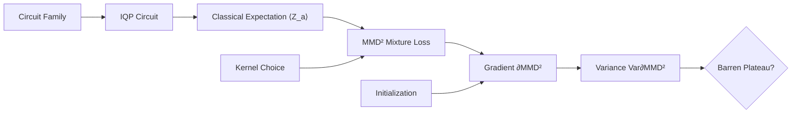

# IQP–MMD Barren Plateau Study

> [!abstract] What this vault is
> A structured knowledge base for the **IQP–MMD Barren Plateau** research project. It documents the theory, codebase, experiments, and research context for a study of whether parameterized IQP circuits trained with MMD loss avoid barren plateaus.

**Central question:** *Do IQP-based generative models trained with MMD genuinely avoid barren plateaus, or does gradient concentration re-emerge under structural, asymptotic, or hardware-realistic conditions?*

---

## Start Here

- [[Weekly Task - Anti-Concentration|📌 This Week's Task — Anti-Concentration]] — next-meeting prep, written in simple terms
- [[Project Overview]] — one-page summary of the research program
- [[Research Questions]] — the four central questions Q1–Q4
- [[Scope Lock]] — the locked study definition from Mar 18, 2026
- [[Glossary]] — vocabulary and notation

## Maps of Content

- [[Theory MOC]] — mathematical content, derivations, definitions
- [[Code MOC]] — architecture and module-by-module documentation of `src/iqp_bp`
- [[Experiments MOC]] — runners, configs, and scaling sweeps
- [[Families MOC]] — IQP circuit connectivity families (F1–F6)
- [[Kernels MOC]] — MMD kernels and their spectral decomposition
- [[Planning MOC]] — proposal, SMART spec, and TODO roadmap

## Core Concepts

## Key Objects

| Object | Notation | Where |
|---|---|---|
| Generator matrix | `G ∈ {0,1}^{m×n}` | [[Generator Matrix]], [[Hypergraph Families]] |
| Parameters | `θ ∈ R^m` | [[IQP Model]] |
| IQP expectation | `⟨Z_a⟩_{q_θ}` | [[IQP Expectation]] |
| MMD loss | `MMD²(p, q_θ)` | [[MMD Loss]] |
| Kernel spectral weights | `w_k(a)` or `P_k(a)` | [[Kernel Spectral Decomposition]] |
| Gradient variance | `Var_θ[∂_{θ_i} MMD²]` | [[Gradient Variance]] |

## Quick Links

- [[Package Layout]] — `src/iqp_bp/` and `src/iqp_mmd/`
- [[How a Scaling Run Works]]
- [[Anti-Concentration]] — the distribution-shape companion check
- [[TODO Roadmap]] — dependency-ordered work queue
- [[References]] — cited papers
