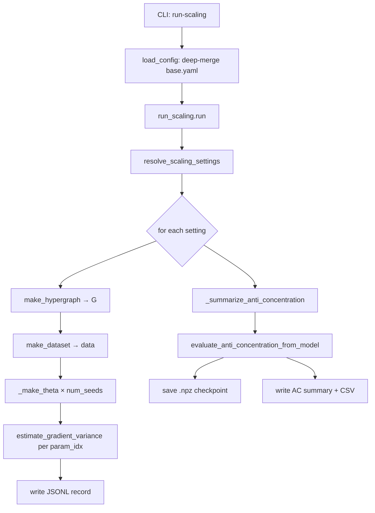

# How a Scaling Run Works

End-to-end walkthrough of what happens when you run:

```bash
python -m iqp_bp.cli run-scaling configs/experiments/scaling_v1.yaml
```

## Call Graph



## Step by Step

1. **Load config** — `iqp_bp.config.load_config` deep-merges the experiment YAML over [[Configs#base.yaml|`configs/base.yaml`]].
2. **Resolve the grid** — `resolve_scaling_settings(cfg)` produces the explicit Cartesian product:
    - families × kernels × init schemes × n-values
    - × per-kernel bandwidths × per-family ER degrees × per-init small-angle stds
3. **Seed streams** — `named_seed_streams(base_seed, ("circuit", "data"), ...)` produces deterministic seeds for each setting-key (see [[RNG]]).
4. **Build G** — `_make_G` calls [[Hypergraph Families|`make_hypergraph`]] with the circuit seed.
5. **Build data** — [[Data Factory|`make_dataset`]] with the data seed.
6. **Build theta ensemble** — `_make_theta` × `num_seeds`, one per parameter seed:
    - `uniform` — `U[-π, π]`
    - `small_angle` — `N(0, σ_θ²)` with the sweep `{0.01, 0.1, 0.3}`
    - `data_dependent` — scale × empirical parity expectations
7. **Kernel params** — `_get_kernel_params` selects `sigma`, `sigmas`, `degree`, etc.
8. **Anti-concentration summary** — runs once per setting on the first theta seed for small $n$ (see [[Anti-Concentration]]).
9. **Gradient variance** — for `param_idx in range(min(5, m))`, call [[Gradients Module|`estimate_gradient_variance`]] which loops over theta seeds internally.
10. **Write JSONL** — one record per `(setting, param_idx)` with the gradient stats + AC fields.

## The Explicit Grid

From `resolve_scaling_settings`:

```python
for family, kernel, init_scheme, n in product(families, kernels, init_schemes, n_qubits):
    for bandwidth, er_p_edge, small_angle_std in product(
        _bandwidth_values_for_kernel(kernel, cfg['kernel']),
        _erdos_renyi_values_for_family(family, cfg['circuit']),
        _small_angle_values_for_init(init_scheme, cfg['init']),
    ):
        settings.append({...})
```

Three per-axis sub-sweeps expand only when relevant:

- `bandwidth` only for `gaussian` / `laplacian`
- `er_p_edge` only for `erdos_renyi`
- `small_angle_std` only for `small_angle` init

## Record Shape

Each JSONL line contains:

```json
{
  "family": "lattice",
  "kernel": "gaussian",
  "init": "small_angle",
  "n": 16,
  "m": 24,
  "param_idx": 0,
  "dataset_type": "product_bernoulli",
  "dataset_metadata": {...},
  "mean": ..., "var": ..., "std": ..., "median": ..., "n_seeds": 100,
  "bandwidth": 0.5,
  "small_angle_std": 0.1,
  "anti_concentration_available": true,
  "ac_scaled_second_moment": 1.42,
  "ac_primary_beta_hat": 0.33,
  "...": "..."
}
```

## Anti-Concentration Block

Only runs when `n <= anti_concentration.max_n` (default 16). Computed once per setting on the first theta seed, then **copied onto every JSONL row for that setting**. Rows above the cap are marked `anti_concentration_available: false` with reason `n_exceeds_max_n:N>M`.

Optional side-outputs if `anti_concentration.export_checkpoint: true`:

- `.npz` checkpoint per setting → `{output_dir}/checkpoints/{family}_n{n}_{kernel}_{init}_seed0.npz`
- JSON summary + CSV + plots → `{output_dir}/anti_concentration/{stem}.*`

## Seeding Policy

All randomness is derived from `experiment.seed` via `derive_seed(base_seed, *parts)`:

- `streams["circuit"]` = seed for `make_hypergraph`
- `streams["data"]`   = seed for `make_dataset`
- `derive_seed(..., "theta", idx)` = seed for each theta init
- `derive_seed(..., "estimation", param_idx)` = seed for the variance estimator

This means any JSONL row is reproducible from `(experiment.seed, setting, param_idx)` alone.

## Related

- [[Scaling Runner]]
- [[RNG]]
- [[Hypergraph Families]]
- [[Data Factory]]
- [[Gradients Module]]
- [[Anti-Concentration]]
