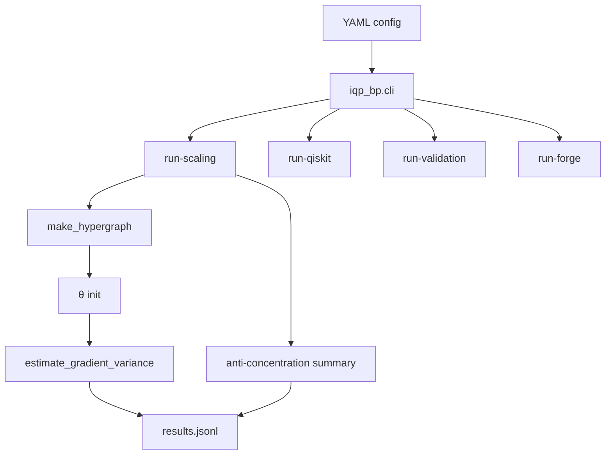

# Project Overview

A unified theoretical, computational, and circuit-level study of **gradient concentration** in IQP-based quantum generative models trained with **Maximum Mean Discrepancy (MMD)** loss.

## The Tension This Project Tries to Resolve

- **IQP circuits are believed to be sampling-hard** and exhibit [[Anti-Concentration|anticoncentration]] (Bremner–Jozsa–Shepherd style).
- **Large-scale classical training of IQP generative models appears feasible** thanks to classical IQP expectation estimators in the [[IQP Expectation|den Nest style]].
- **Standard VQAs typically suffer exponential gradient suppression** — the [[Barren Plateaus|barren plateau]] phenomenon.

The unresolved question: can the classical-training / quantum-inference split retain the sampling-hardness motivation while avoiding barren plateaus? See [[Research Questions]].

## The Four Study Axes

1. **Circuit family** — see [[Families MOC]]. Four SMART families: [[Product State Family|product state]], [[ZZ Lattice Family|2D ZZ lattice]], [[Erdos-Renyi Family|sparse Erdős–Rényi]], [[Complete Graph Family|complete graph]].
2. **Kernel** — see [[Kernels MOC]]. Primary: [[Gaussian Kernel]]. Phase 2: [[Laplacian Kernel]], [[Multi-Scale Gaussian Kernel]].
3. **Initialization** — see [[Initialization Schemes]]. Three schemes: uniform, small-angle, data-dependent.
4. **System size n** — up to ~1024 qubits in the scaling runner; Qiskit and Forge caps are smaller.

## What the Pipeline Does

For the full walkthrough, see [[How a Scaling Run Works]].

## Two Sibling Packages

- **`iqp_bp`** — the barren plateau / gradient-variance study. Primary package for this vault.
- **`iqp_mmd`** — the upstream MMD training toolkit based on [XanaduAI/scaling-gqml](https://github.com/XanaduAI/scaling-gqml). Used as a training pipeline that now also exports `.npz` checkpoints for `iqp_bp` validation.

See [[Package Layout]] and [[Checkpoint Bridge]].

## Time Window

- **Start:** Mar 18, 2026
- **End:** May 15, 2026
- **Duration:** ~8 weeks
- See [[SMART Spec]] and [[TODO Roadmap]] for scheduling.

## Related Research

- Rudolph et al. 2023 — *Trainability barriers and opportunities in quantum generative modeling* ([[References#Rudolph 2023|2305.02881]])
- Larocca et al. 2024 — *Barren Plateaus in Variational Quantum Computing* ([[References#Larocca 2024|2405.00781]])
- Mhiri et al. 2025 — *Warm-start guarantees* ([[References#Mhiri 2025|2502.07889]])
- Scaling GQML paper ([[References#Scaling GQML|2503.02934]])
